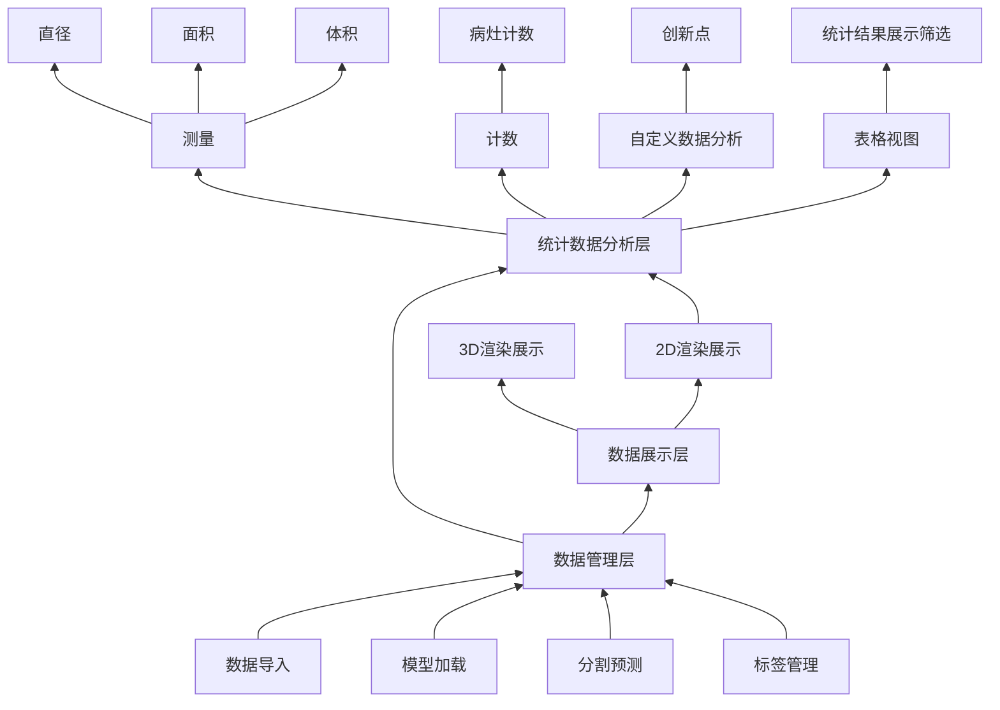

# A3-基于百度飞桨的 3D 医疗数据解析平台 SKDDX20 组

> - 软件杯 http://www.cnsoftbei.com/plus/view.php?aid=796
> - 打榜平台 https://aistudio.baidu.com/aistudio/competition/detail/889/0/introduction

## 文档索引
- [算法任务（完善中）](/docs/Algorithm/README.md)
- [项目架构（完善中）](/docs/README.md)
- [前端任务（完善中）](/docs/FrontEnd/README.md)
- [后端任务（云开发环境 使用 GitLab 管理代码）](https://gitlab.com/pzq123456/backend_md)

## 赛事流程
- `算法打榜`预选赛（截止2023年5月21，打榜赛，根据算法成绩决定晋级区域赛；5月31针对未晋级区域赛的同学，开展复活赛，仅考核软件，考核方式为提交软件演示录制视频即可，不答辩）要点:

    * `算法部分`（30%）: 本次比赛要求选手将算法结果/模型提交至AI Studio进行自动评测。要求选手基于`PaddlePaddle`，在官方指定数据集上进行打榜，实现在验证集上，给定任一3D医疗数据，准确地完成医学数据的分割任务。 

    * `软件部分`（70%）: 要求选手实现基于`WEB`的3D医疗数据解析平台。(主体是前端项目(80%)，附加一部分后端算法(20%))

## 软件(70%)功能详细要求

1. 3D数据读取与推理(包括导入数据、加载模型和分割预测)
- `导入数据` : 图像支持格式包含 `nii,nii.gz,mhd,raw,dcm` 等常见格式
- `加载模型` : 支持模型的介绍、选择与加载
- `分割预测` : 基于导入模型，对任一测试数据进行推理分割并将分割后的结果保存为标签
- `标签管理` : 支持标签的增删、修改和颜色的切换；支持标签的导出保存，导出的标签格式和输入图像格式一致；（通常来说，图像分割的输入是一张图像，输出也是一张图像，每个像素点都对应一个标签。）

2. 预测展示:

    2.1 原图和标签支持3D可视化:
    - 三视图展示原图和标签显示，每个视图支持鼠标拖动进行切片切换、鼠标拖动带动3D原点的变化，视图支持缩放和窗宽窗位调整
    - 支持使用`笔刷`、`橡皮擦`、`提取最大连通域`等方式对模型推理分割结果进行优化，并将结果在三视图和 `3D 渲染效果`中展示

    2.2 `数据分析`:

    - `测量` : 基于 `spacing` 等参数，获取测量分割目标在 `x, y, z` 切面上的直径、面积和目标体积等结果
    - `计数` : 基于现有分割结果，统计不同类别数据的个数，例如某类病灶的计数
    - `自定义数据分析` : 基于用户上传的后处理脚本返回结果进行合理的展示和分析（可以规定后处理的返回内容和方式）
    - `统计结果展示` : 针对用户上传的所有医疗数据进行上述分析，并对分析结果进行图标展示.并支持显示所有符合`筛选`要求的数据索引

3. 其他创新附加功能。（10%）
- 如根据各类分割及分析结果，自动生成高质量病例报告。
- `筛选` : 支持根据数据的属性进行筛选，例如数据的年龄、性别、病灶类型等
- `modelZoo`: 支持用户选择不同的模型进行分割预测

## 业务逻辑整理
> 图表使用 [mermaid](https://mermaid.js.org/intro/) 生成




## 已知的资源

| 项目 | 说明 | 地址 | 前端 | 后端 |
| --- | --- | --- | --- | --- |
| OHIF | 一个开源的医学影像查看器 | https://ohif.org/ | 1 | 0 |
| Cornerstone | 医学影像前端二维处理套件 | https://www.cornerstonejs.org/ | 1 | 0 |
| Med3web | 一个开源 3D 医学影像查看器 | https://github.com/SindenDev/med3web | 1 | 0 |
| VTK.js | 一个开源的 3D 可视化库 | https://kitware.github.io/vtk-js/ | 1 | 0 |
| Orthanc | 一个开源 DICOM 服务器 | https://www.orthanc-server.com/ | 0 | 1 |
| NeurDICOM | 一个开源的 WecDICOM 后端 | https://github.com/reactmed/neurdicom | 0 | 1 |

## 项目管理开发工具

### 团队管理工具
- `git`：代码管理工具
- `github`：代码托管平台
### 文档管理工具
- `jsdoc`：文档生成工具
- `pydoc`：文档生成工具

### 技术栈
- 后端
  - `python`：后端开发语言
      * `flask`：后端框架(接口封装)
      * `paddle`：飞桨框架(算法)
  - `Radis`：缓存数据库(用以实现进度条等功能)
  - `sqlite`：关系型数据库(用以存储用户信息)
- `javascript`：前端开发语言
    * `vue`：前端框架
    * `cornerstone`：2D可视化（三视图）及量测、分割等功能
    * `vtk.js`：3D可视化库

## 信息

- 成员信息
    ```
    潘志清 18352874270 
    于嘉烨 19506151951
    韦立楠 16688089588
    覃仕锋 18077287271
    ```
- 老师信息
    ```
    刘冰
    13780686818
    LB@sdust.edu.cn
    计算机科学与工程学院，测绘与空间信息学院
    智慧城市，GIS应用与开发
    副教授
    ```

## 服务器信息
```
root@124.220.5.235
```
```
1DB5m3AHHjf6d6UhYT8Z1Bw
```
## gitlab 公共账号
```
1812673119@qq.com
```
```
9Lp57-P.67cPRZ8
```
https://github.com/Project-MONAI/model-zoo/tree/dev/models/swin_unetr_btcv_segmentation
## WebDicom 服务器地址
http://124.220.5.235:8042/dicom-web/studies

## Labeling and Segmentation 部分参考项目
https://github.com/Project-MONAI/MONAILabel/tree/main/plugins/ohif
