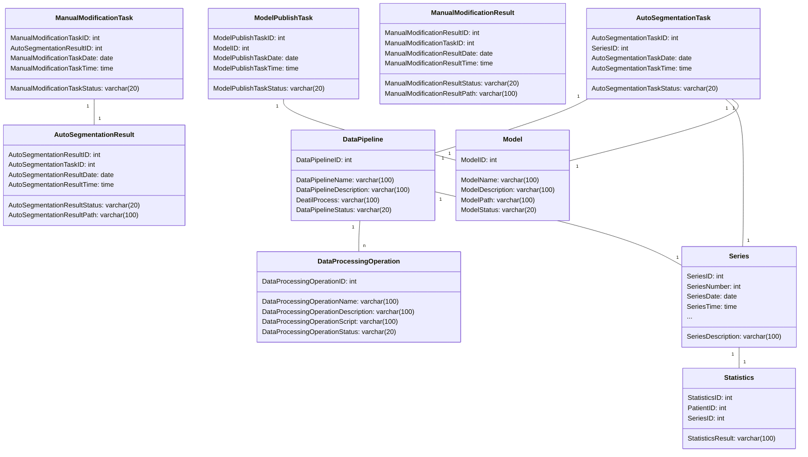

# 实验三 PowerDesign设计GIS数据库（2学时）
## 一、实验目的
掌握使用PowerDesigner 工具
掌握创建CDM概念数据模型的方法
完成数据库表的创建和修改等工作
## 二、实验内容
使用 PowerDesigner按下列要求创建用户数据库模型
1.PowerDesigner软件的安装 
2.GIS数据库需求分析
3.设计数据库并创建CDM概念数据模型
## 三、实验步骤
### 安装PowerDesigner软件
- 略
### 熟悉软件环境，了解软件的功能、用途和使用方法
- 略
### 数据库建模
#### 1. 系统包含的实体及其属性

`静态实体`:
- 医疗影像序列(Series)
```sql
Series(
    SeriesID: int,
    SeriesNumber: int,
    SeriesDate: date,
    SeriesTime: time,
    SeriesDescription: varchar(100),
    Modality: varchar(20),
    BodyPartExamined: varchar(20),
    ViewPosition: varchar(20),
    PatientPosition: varchar(20),
    Laterality: varchar(20),
    InstitutionName: varchar(100),
    Manufacturer: varchar(100),
    ManufacturerModelName: varchar(100),
    StationName: varchar(100),
    DeviceSerialNumber: varchar(100),
    SoftwareVersions: varchar(100),
    ProtocolName: varchar(100),
    OperatorName: varchar(100),
)
```
- 医疗影像统计信息(Statistics)
```sql
Statistics(
    StatisticsID: int,
    PatientID: int,
    SeriesID: int,
    StatisticsResult: varchar(100),
    )
```
- 模型(Model)
```sql
Model(
    ModelID: int,
    ModelName: varchar(100),
    ModelType: varchar(20),
    ModelDescription: varchar(100),
    ModelPath: varchar(100),
    ModelParameter: varchar(100),
    ModelVersion: varchar(20),
    ModelInputFormat: varchar(20),
    ModelOutputFormat: varchar(20),
    ModelSize: int,
    ModelDate: date,
    ModelTime: time,
    ModelAuthor: varchar(20),
    ModelInstitution: varchar(100),
    )
```
- 数据处理操作（包括数据预处理与后处理，可相互叠加）
```sql
DataProcessingOperation(
    DataProcessingOperationID: int,
    DataProcessingOperationName: varchar(100),
    DataProcessingOperationDescription: varchar(100),
    DataProcessingOperationPath: varchar(100),
    IsPreprocessing: bool,
    IsPostprocessing: bool,
    IsModel: bool,
    ModelID: int,
    InputFormat: varchar(20),
    OutputFormat: varchar(20),
    )
```
`动态实体`:
- 自动分割任务(AutoSegmentationTask)

```sql

AutoSegmentationTask(
    AutoSegmentationTaskID: int,
    PatientID: int,
    SeriesID: int,
    ModelID: int,
    AutoSegmentationTaskDate: date,
    AutoSegmentationTaskTime: time,
    AutoSegmentationTaskStatus: varchar(20),
    AutoSegmentationTaskResult: varchar(100),
    )
    
```
- 自动分割结果(AutoSegmentationResult)：

```sql
AutoSegmentationResult(
    AutoSegmentationResultID: int,
    AutoSegmentationTaskID: int,
    AutoSegmentationResultDate: date,
    AutoSegmentationResultTime: time,
    AutoSegmentationResultStatus: varchar(20),
    AutoSegmentationResultPath: varchar(100),
    )
```
- 手动修饰任务(ManualModificationTask)：
```sql
ManualModificationTask(
    ManualModificationTaskID: int,
    PatientID: int,
    SeriesID: int,
    ModelID: int,
    ManualModificationTaskDate: date,
    ManualModificationTaskTime: time,
    ManualModificationTaskStatus: varchar(20),
    ManualModificationTaskResult: varchar(100),
    )
```
- 手动修饰结果(ManualModificationResult)：
```sql
ManualModificationResult(
    ManualModificationResultID: int,
    ManualModificationTaskID: int,
    ManualModificationResultDate: date,
    ManualModificationResultTime: time,
    ManualModificationResultStatus: varchar(20),
    ManualModificationResultPath: varchar(100),
    )
```
模型发布任务(ModelPublishTask)：
```sql
ModelPublishTask(
    ModelPublishTaskID: int,
    ModelID: int,
    ModelPublishTaskDate: date,
    ModelPublishTaskTime: time,
    ModelPublishTaskStatus: varchar(20),
    )
```
数据流水管线(DataPipeline)：
```sql
DataPipeline(
    DataPipelineID: int,
    DataPipelineName: varchar(100),
    DataPipelineDescription: varchar(100),
    DeatilProcess: varchar(100),
    DataPipelineStatus: varchar(20),
    )
```
#### 2. 实体之间的关系及动态实体的生命周期
在该系统中，我们围绕医疗影像序列(Series)这一实体进行建模，该实体与其他实体的关系如下：
- 医疗影像序列(Series)与医疗影像统计信息(Statistics)是一对一关系，一个医疗影像序列对应一条医疗影像统计信息。
- 我们使用数据操作实体(DataProcessingOperation)来描述数据处理操作，数据处理操作既可以只包含简单的处理脚本也可以包含模型(Model)。在实际实现中，我们的数据流水管线是一个包含一系列数据处理操作的队列，数据流水管线(DataPipeline)与数据处理操作(DataProcessingOperation)是一对多关系，一个数据流水管线对应多个数据处理操作。
- 用户通过调用自动分割任务(AutoSegmentationTask)来使用模型(Model)对医疗影像序列(Series)进行自动分割。自动分割任务通过构造数据流水管线(DataPipeline)来实现，数据流水管线(DataPipeline)是由数据处理操作(DataProcessingOperation)构成的，数据处理操作(DataProcessingOperation)包括数据预处理与后处理，可相互叠加。一个数据流水管线对应一个自动分割任务，一个自动分割任务对应一个医疗影像序列。自动分割任务(AutoSegmentationTask)与自动分割结果(AutoSegmentationResult)是一对一关系，一个自动分割任务对应一个自动分割结果。自动分割的过程附带进行病理统计，因此自动分割结果(AutoSegmentationResult)与医疗影像统计信息(Statistics)是一对一关系，一个自动分割结果对应一条医疗影像统计信息。
- 用户可以调用手动修饰任务(ManualModificationTask)对自动分割结果(AutoSegmentationResult)进行手动修饰，一个手动修饰任务对应一个自动分割结果，一个手动修饰任务对应一个医疗影像序列。手动修饰任务(ManualModificationTask)与手动修饰结果(ManualModificationResult)是一对一关系，一个手动修饰任务对应一个手动修饰结果。手动修饰的过程附带进行病理统计，因此手动修饰结果(ManualModificationResult)与医疗影像统计信息(Statistics)是一对一关系，一个手动修饰结果对应一条医疗影像统计信息。
- 用户可以调用模型发布任务(ModelPublishTask)将模型(Model)发布到系统中，一个模型发布任务对应一个模型。一次模型发布任务执行成功后创建一个模型，一个模型实体对应一个模型发布任务。模型发布任务(ModelPublishTask)与模型(Model)是一对一关系，一个模型发布任务对应一个模型。系统可以在模型列表中显示所有已发布的模型。

### 创建CDM概念数据模型


## 四、实验成果
- 本次实验的成果是一个基于CDM的概念数据模型，该模型可以用于构建医疗影像分析系统的数据库，该数据库可以用于存储医疗影像序列、医疗影像统计信息、模型、自动分割任务、自动分割结果、手动修饰任务、手动修饰结果、模型发布任务等数据。

## 五、实验总结
- 本次实验的主要目的是学习如何使用CDM建模，通过本次实验，我学会了如何使用CDM建模，以及如何将CDM转换为关系数据模型。在本次实验中，我遇到了一些问题，比如我不知道如何将CDM转换为关系数据模型，通过查阅资料，我学会了如何将CDM转换为关系数据模型。通过本次实验，我对CDM有了更深入的了解，我认为CDM是一种非常好的建模方法，它可以帮助我们更好地理解现实世界中的实体及其之间的关系，它可以帮助我们更好地设计数据库，它可以帮助我们更好地理解数据库中的数据。