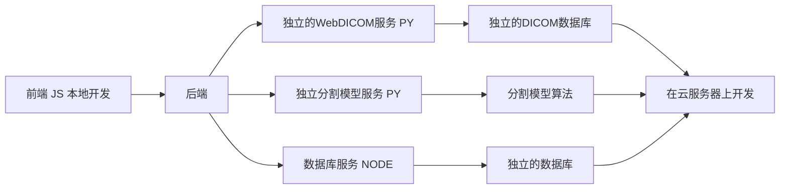

# 项目文档

> 本文档中，我会约定一些开发规范、注意事项，以及经验总结。

- [算法](./Algorithm/README.md)
- [前端](./FrontEnd/README.md)
- [后端](./BackEnd/README.md)


```bash
docs/
├── Algorithm
    ├── README.md
    ├── imgs
├── Backend
    ├── README.md
    ├── Database.md
    ├── imgs
├── Frontend
    ├── README.md
    ├── 3DViewer.md
    ├── imgs
```


## 开发流程

每个人在写代码之前，都需要先写文档简单说明一下自己的设计思路。具体流程：

1. 在对应的文件夹下新建`*.md`文件,文件名为模块名。例如：`Frontend/3DViewer.md` 、 `Backend/Database.md` 。
2. 最好在写代码之前，在对应的文档里写清楚自己的思路，毕竟是团队开发，要想办法帮助别人理解你的代码。
3. 在本地测试通过后再提交代码。开发过程中，我们也会用到分支管理。

    ```mermaid
    graph LR
    A[组件式开发] --> B[模块化开发]
    C[文档化开发] --> B

    B --> D[测试驱动开发]
    D --> E[代码提交]

    ```

 - `组件式开发`：后期会划分组件开发的任务。这一块难度较大。而且要调用模型接口，所以开发的时候，假如模型还没有整理好，就需要先用假数据支撑开发。
 - `测试驱动开发`：每一个模块都需要测试，本地测试通过才能提交代码。
 - `模块化开发`：每一个模块都需要有清晰的接口，模块之间的接口也需要清晰。
 - `文档化开发`：每一个模块都需要有清晰的文档。先有文档设计，再有代码实现。

    > `解释`：
    > - 由组件构成模块，
    > - 由模块构成系统。
    > - 组件不仅仅是带有用户界面的组件，还包括其他一些封装好的逻辑组件。
    > - 模块是由多个组件组成的，模块之间通过接口进行通信。模块之间的接口也需要有清晰的文档。

## 项目架构

1. 项目前端部分在本地开发: 
   - 运行本地开发服务器 `vite` ，在本地开发，使用模拟数据。
   - 模拟数据主要是 `DICOM` 数据，这一块我尽快整理好。
2. 后端部分在云服务器上开发: 
   - 后端涉及较多的环境配置，所以在云服务器上进行团队开发。
   - 如果后端开发进度较快，可以逐步和前端整合。
   - 后端开发的时候，需要先写好接口文档。
   - 若模型无法在百度平台上部署，就需要本地部署，部署在云服务器可以省去本地配环境的步骤。
3. 模块化开发: 
    - 软件根据功能划分为多个模块，每个模块都有清晰的接口。
    - 不同的模块之间通过接口进行通信。
    - 模块化开发的好处是，可以并行开发，提高开发效率。并且前后端都可以根据这个思想进行开发。
> 模块化开发前端例子：
> - 我们的项目既有二维查看器，也有三维查看器，这两个查看器都是独立的模块。
> - 每个查看器又可以分为若干组件，例如：二维查看器可以分为：图像组件、标注组件、工具组件、信息组件等。
> - 这种由组件构成模块，由模块构成系统的思想，可以提高开发效率，也可以提高代码的可维护性。

## 开发意向
> 该部分需要协作完成，你们在本地修改并提交。
> - 我会大体切分一下任务，根据自己擅长的领域，选择自己想要做的任务。

### 前端

- 二维查看器
- ~~三维查看器~~ (潘)
- 二维标注
- 表管理及渲染
- 页面布局
- 数据支撑层
- 工具算法库

### 后端

- 数据库设计 (表设计、CRUD 接口设计)
- 数据库接口实现及测试
- 模型算法封装
- 后端工具算法库
- 服务器运维
- 服务器环境配置
- WebDICOM 服务器 (部署/开发)

> 选择完成后，就可以写文档了。首先现在自己的模块下新建`*.md`文件，文件名为模块名。例如：`Frontend/3DViewer.md` 、 `Backend/Database.md` 。并在`README.md`中添加链接,方便其他人查看。
