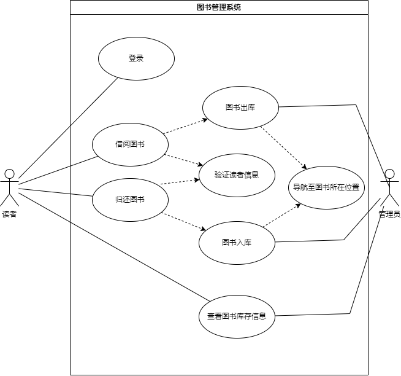
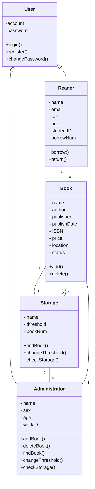
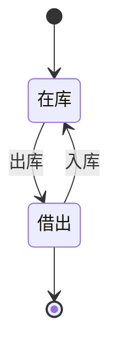
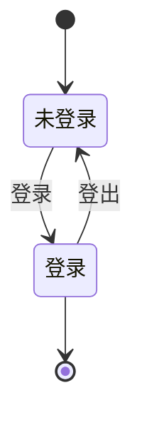
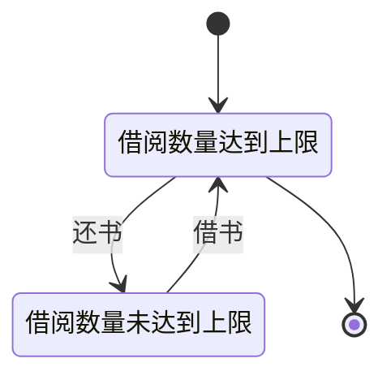
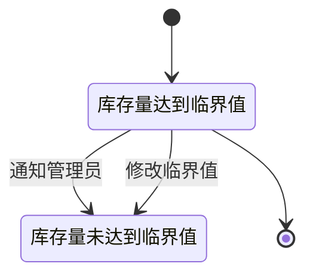

# 实验四 使用UML分析GIS小工程（2学时）
## 一、实验目的
熟悉UML软件的功能；
理解UML模型构成；
掌握用例图、静态图、行为图、交互图的表达和绘制方法。
## 二、原理与方法
学习使用UML、采用UML语言对图书馆查书事件绘制用例图、静态图、行为图、交互图。
## 三、实验内容与步骤
安装UML软件。
熟悉软件环境，了解软件的功能、用途和使用方法。
学习用例图、静态图、行为图、交互图的表达和绘制方法。

- 库存清单主文件: 
    - 学校图书馆的各类藏书数量
    - 库存量临界值等数据记录

- 各类书籍摆放在书架上

- 需要借书时:
    - 通过条码或二维码查找书籍所在书架位置
    - 给出当前所在位置到需要借阅的图书位置导航路线

分别面向对象的方法对该查书借书过程进行分析，在UML中用相应的视图反映用例捕获、系统分析和系统设计的成果。

### 1. 用例图
> 用例图是用例模型的静态视图，用于描述系统的功能需求，它是从用户角度描述系统的功能，用例图是系统的蓝图，是系统的总体概貌。
用户： 借书人、图书管理员
用例： 查书、借书、还书

查书用例：
- 借书人输入书名或者书籍的条形码或者二维码
- 系统根据输入的信息查询书籍的位置

借书用例：
- 借书人输入书名
- 借书人根据书籍的位置找到书籍
- 借书人将书籍交给图书管理员
- 图书管理员扫描书籍的条形码或者二维码，登记出库

还书用例：
- 借书人将书籍交给图书管理员
- 图书管理员扫描书籍的条形码或者二维码，登记入库
- 图书管理员根据系统给出的位置，将书籍放回书架



### 2. 静态图/类图
> 静态图是用于描述系统的静态结构，包括类图、对象图、包图、组件图和部署图。
- User 用户类: 借书人、图书管理员
  - 属性: 账号、密码
  - 方法: 登录、注册、修改密码

- Reader 读者类(由用户类派生)
  - 属性: 姓名、性别、年龄、学号、借书数量
  - 方法: 借书、还书

- Administrator  图书管理员类(由用户类派生)
  - 属性: 姓名、性别、年龄、工号
  - 方法: 图书入库、图书出库、查找书籍位置、修改库存量临界值、查看库存清单

- Book 书籍类: 书籍
  - 属性: 书名、作者、出版社、出版日期、ISBN、价格、书籍位置、当前状态
  - 方法: 入库、出库

- Storage 库类: 库
  - 属性: 库名、库存量、库存量临界值
  - 方法: 查找书籍位置、修改库存量临界值、查看库存清单
  
- 关系:
  - 用户类与读者类、图书管理员类是泛化关系
  - 读者类与书籍类是关联关系
  - 图书管理员类与书籍类是关联关系
  - 书籍类与库类是关联关系
  - 库类与书籍类是聚合关系
  - 库类与图书管理员类是关联关系



### 3. 行为图/状态图
> 行为图是用于描述系统的动态行为，包括活动图、状态图、时序图和通信图。
- 状态图
  - 书籍状态
    - 状态: 在库、借出
    - 事件: 入库、出库
    - 动作: 入库、出库
    - 状态转移: 入库、出库


  - 用户状态
    - 状态: 登录、未登录
    - 事件: 登录、登出
    - 动作: 登录、登出
    - 状态转移: 登录、登出



  - 读者状态
    - 状态: 借阅数量达到上限、借阅数量未达到上限
    - 事件: 借书、还书
    - 动作: 借书、还书
    - 状态转移: 借书、还书




  - 库状态
    - 状态: 库存量达到临界值、库存量未达到临界值
    - 事件: 通知管理员、修改临界值
    - 动作: 通知管理员、修改临界值




## 四、实验成果
## 五、实验总结

## Notes
### class图
1. visibility
    - public : +
    - private  : -
    - protected : #
    - package : ~


2. relation
    - inheritance(继承) : 空心三角形

    ```mermaid
        classDiagram
            class A
            class B
            A <|-- B
    ```

    - association(关联) : 实心线

    ```mermaid
        classDiagram
            class A
            class B
            A -- B
    ```

    - aggregation(聚合) : 空心菱形

    ```mermaid
        classDiagram
            class A
            class B
            A o-- B
    ```
    - composition(组合) : 实心菱形

    ```mermaid
        classDiagram
            class A
            class B
            A *-- B
    ```

    - dependency(依赖) : 虚线箭头

    ```mermaid
        classDiagram
            class A
            class B
            A ..> B
    ```

3. multiplicity(多重性) 
   - 0..1 : 0或1
   - 0..* : 0或多个
   - 1..* : 1或多个
   - 1 : 1个

    ```mermaid
        classDiagram
            class A
            class B
            A "0..1" -- "0..*" B
    ```
4. role name(角色名)
    - 用于标识关联的角色
    - 位于关联线上
    - 位于关联线的中间
    - 位于关联线的两端

    ```mermaid
        classDiagram
            class A
            class B
            A "0..1" -- "0..*" B : role name
    ```
5. class name(类名)
    - 位于类的上方
    - 位于类的中间
    - 位于类的下方

    ```mermaid
        classDiagram
            class A
            class B
            A "0..1" -- "0..*" B : role name
    ```
6. attribute(属性)
    - 位于类的中间
    - 位于类的下方
    - 位于类的上方

    ```mermaid
        classDiagram
            class A
            class B
            A "0..1" -- "0..*" B : role name
    ```