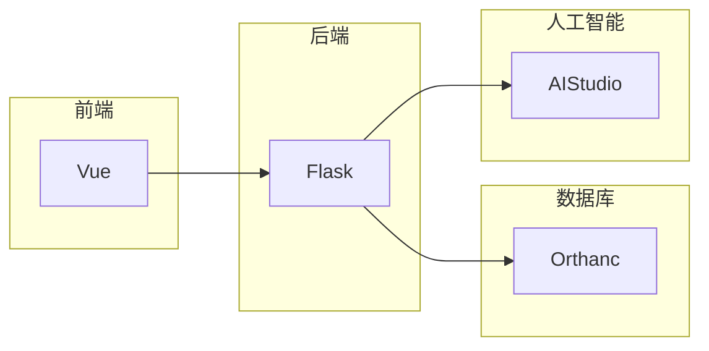
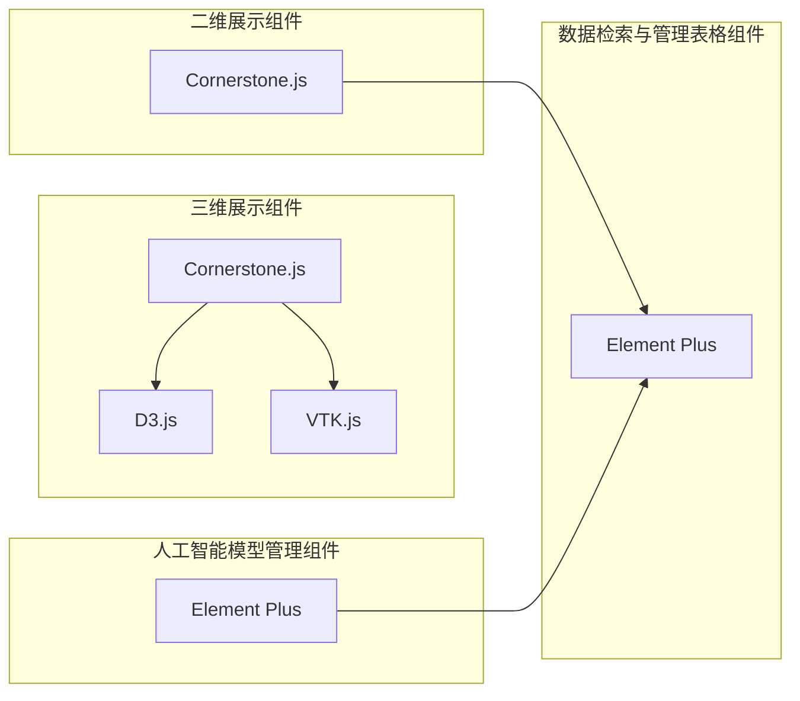
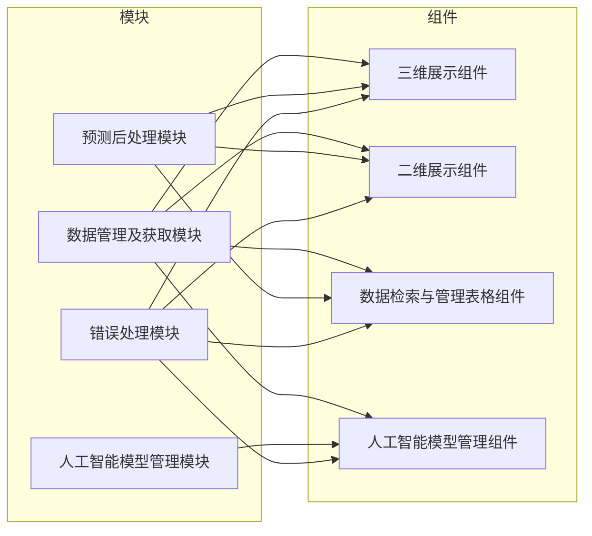
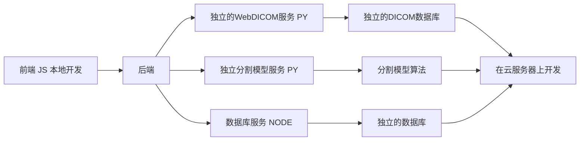
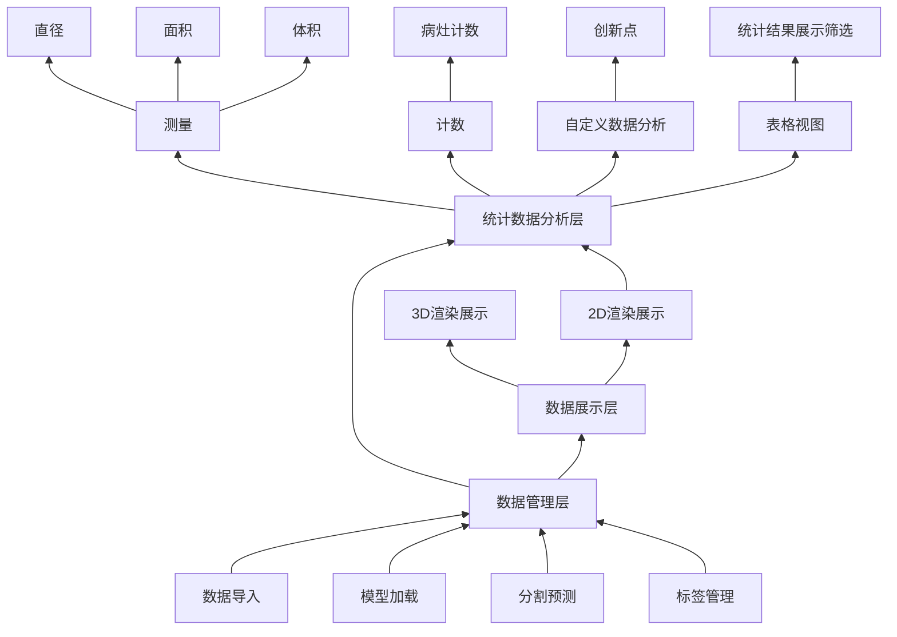
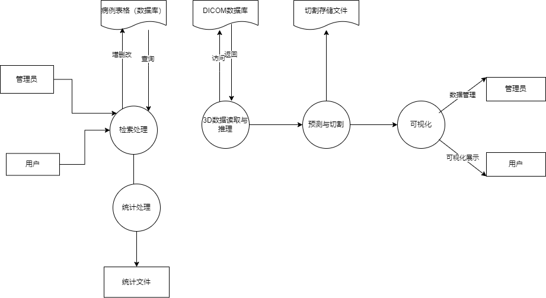
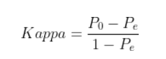
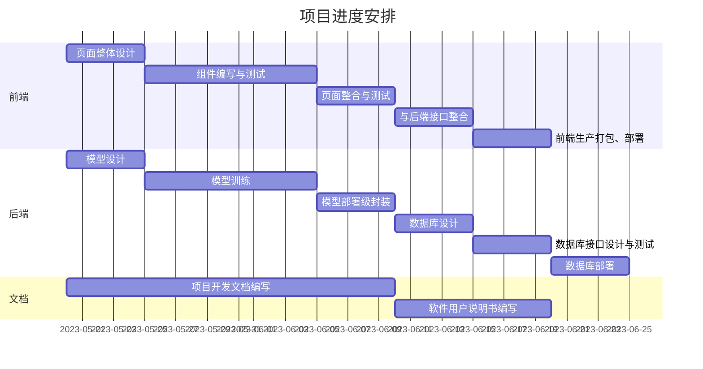

# 立项报告
> 基于人工智能的3D 医疗 Web 平台
> - 5.26 10:21
本项目是 `软件杯 医疗影像` 赛道的参赛项目。该比赛需要我们利用人工智能、大数据及 `Web3.0` 等先进技术为传统医疗影像行业赋能，促进医疗行业的信息化、智能化发展。
## 可行性分析
### 政策 （于）

- 《新一代人工智能发展规划》：从2017年开始，在国务院发布《新一代人工智能发展规划》在第二大项第四部分中就明确指出 “ **培育智能产品—医疗影像辅助诊断系统** ” ，提出推动医学影像数据采集标准化与规范化，支持脑、肺、眼、肠、骨、心脑血管、乳腺等典型疾病领域的医学影像辅助诊断技术研发，加快医疗影像辅助诊断系统的产品化及临床辅助应用。

- 《“十四五”医疗装备产业发展规划》：在2021年12月发布的由十部门印发的《“十四五”医疗装备产业发展规划》中指出发展新一代医学影像装备，推进智能化、远程化、小型化、快速化、精准化、多模态融合、诊疗一体化发展。发展新型体外诊断装备、新型高通量智能精准用药检测装备，攻关先进细胞分析装备，提升多功能集成化检验分析装备、即时即地检验(POCT)装备性能品质。

- 《医疗机构设置规划指导原则（2021-2025年）》： 在2022年2月份国家卫健委发布《医疗机构设置规划指导原则（2021-2025年）》（以下简称《规划》），明确未来5年基层医疗机构发展方向和具体指标。《规划》明确，到2025年，全国医疗机构设置规划设立了包含县立以及基层机构的床位数量以及明确强调了各级医疗机构（卫生院、村卫生室）兜底医疗服务网络、加速乡一体化分级诊疗、基层老年医学（医养结合）发展方向、鼓励社会办医、发展中医药；强化信息化的支撑作用，推动人工智能、大数据、云计算、5G、物联网等新技术与医疗深度融合，推进智慧医院建设和医院信息标准化建设。

从上述政策中可以看出，**国家对人工智能与医疗产业的结合一直是大力支持的**，推动人工智能在辅助诊断、医学影像、电子病历、医院管理等多个领域发挥作用，是发展**智慧医疗产业**的核心技术基础。尤其是人工智能赋能的医学影像技术在中华医学会中获得权威专家的认可，中华医学会影像技术分会主任委员李真林2021年12月27发表了医学影像领域的学科发展、科研突破方面的观点：“AI赋能医学影像主要是为疾病的诊疗提供了科学和直观的依据，已成为临床医生诊治疾病的眼睛；在临床诊疗中，人工智能赋能医学影像已经由临床辅助检查手段发展成临床诊断疾病的主要方法，广泛应用于体检、疾病筛查、诊断与鉴别、疗效评价及预后等多个方面，为人民群众提供全方位全周期的健康保障。”

目前AI与医学影像已经开展深度融合。我国目前的AI影像发展状况，已应用于影像技术的各个场景。针对医学影像进行AI技术处理主要分为图像处理、辅助诊断和影像质量提升三个方面。在图像处理方面包括图像分割、目标检测、图像分类、图像配准、图像映射等技术范围；在辅助诊断方面，实现了如消化道辅助诊断、肺结节早期筛查、乳腺病变筛查、智能骨伤鉴定、结肠癌早期筛查等功能；在利用AI技术提高医学影像的质量的方面，通过AI算法的图像重建技术，可将低剂量CT、PET图像重建得到相当于高剂量CT的高质量图像，起到临床上减少辐射剂量作用的同时不会降低影像质量。

从目前技术的应用来看与AI结合建立网络大数据诊疗平台前景十分广阔。随着影像AI的应用，对数据的大平台需求将会更加强烈，搭载影像AI网络应用的平台，不仅能进一步规范影像图像数据标准，有助于实现各影像中心、联盟医院影像数据的互联互通，优质影像医疗资源云端协同共享，助力海量诊疗级大数据深度挖掘应用；还会进一步提高图像的质量和精准化诊断，提高诊疗效率，减轻医生工作量。并且近年来政策驱动作用明显，医疗AI三类证（我国医疗器械安全最高标准）审批加速，行业迈入商业化阶段。国务院、工业和信息化部、国家药品监督管理局（NMPA）等颁布系列政策文件，大力推广AI技术在医疗各细分领域的应用。所以目前AI与医学影像结合建立网络平台的项目在政策上和目前的发展状况上都是十分具有可行性的。
### 经济 （韦）
基于人工智能的3D 医疗 Web 平台系统具有广阔的市场前景和可持续发展性，不仅能提高医疗服务的质量和效率，更能够有效降低医疗成本，为医疗机构带来可观的经济效益。
- 市场需求：随着人们健康意识的提高，医疗健康行业的市场需求不断增长。据统计，全球医疗市场规模已超过1万亿美元，而人工智能技术在医疗健康领域的应用前景广阔。因此，本项目具有良好的市场前景和商业价值。
- 竞争分析：目前，国内外已有一些医疗健康领域的人工智能企业涉足3D可视化技术。然而，本项目的特色在于将人工智能技术与3D技术相结合，实现医疗数据的高效可视化和智能分析，具有较强的竞争优势。
- 风险分析：本项目存在技术研发风险、市场风险和资金风险等方面的风险。但是，我们将采取有效的风险管理措施，降低风险发生的概率和影响，确保项目的稳定发展。
### 技术上进行分析 （潘）
#### 技术概述
本项目前后端分离，前端采用 `JavaScript` 语言的 `Vue` 框架搭建，后端使用 `Python` 语言的 `Flask` 框架实现一套 `RESTful` 接口以支持业务。其中人工智能部分的特色功能通过调用部署在百度 `AIStudio` 上的模型接口来实现。为了经一步加强项目的健壮性，减少不必要的耦合，我们专门使用 `Orthanc` 软件来管理医疗影像数据。以下是架构略图

> 项目托管在 `GitHub` 平台上，由于参加比赛的缘故，尚未开源。比赛结束后，我们会整理好项目，并开放源码。
#### 前端项目技术分析

前端项目使用 `Vue` 框架搭建，使用 `Element Plus` 作为组件库，使用 `axios` 作为网络请求库，使用 `vue-router` 作为路由管理器。同时，为了满足医疗影像行业的一般需求，我们使用 `cornerstone.js` ， `D3.js` 及 `VTK.js` 等前端包来支撑医疗影像数据的展示、标注、管理及三维分析。为了贴合业界生产实际，我们采用 `Vite` 作为打包工具，实现自动化构建。

为了便于项目管理、构建及代码复用，我们采用 模块化、组件化 的方式构建前端项目。

我们充分利用 `Vue 组合式 api` 的特点，将那些重复的、易于复用的业务逻辑封装为模块（没有视图的组件）。这些模块主要包括：数据管理及获取模块、人工智能模型管理模块、预测后处理模块、错误处理模块等。由于医疗影像数据众多，结构复杂，管理困难，我们封装 `dcmjs` 及 `dicomweb-client.js`用以快速加载和检索医疗影像数据。为了便于使用百度提供的模型接口，我们将该接口封装为单独模块，并与模型管理视图配合实现拖拽式部署数据流的特色功能。人工智能模型预测结果难免有误差，所以需要人工修正。这一块需要综合数据获取、数据修改、数据检索等常规功能，所以可以将其封装为单独的模块。这些模块将必要的功能接口以命令及函数的形式暴露出来，最大限度方便视图组件的调用。

为了适应医疗影像行业的需求，我们搭建了不同的组件包括：三维展示组件、二维展示组件、数据检索与管理表格组件、人工智能模型管理组件等。通过灵活地组合与复用这些组件，我们可以快速构建适用于不同医疗影像工作流的应用页面。

以下是设计示意图：

以下是模块及组件的关系图：



## 需求分析 
### 项目的定义 （于）
我们致力于构建一个基于Web的人工智能3D诊疗平台，用户可以输入或者浏览检索数据库中的医学影像，利用我们提供的人工智能算法完成对医学影像的2D和3D模型构建，同时可以利用我们提供的工具完成对医学影像的测量、标注和统计数据的浏览，并且能利用我们提供的人工智能分析算法完成对潜在病灶的预测，实现辅助诊断的功能。
### 功能性与非功能性需求 （韦）
#### 功能性需求
1. 3D数据读取与推理(包括导入数据、加载模型和分割预测)
- 导入数据: 图像支持格式包含 `nii,nii.gz,mhd,raw,dcm` 等常见格式
- 加载模型: 支持模型的介绍、选择与加载
- 分割预测: 基于导入模型，对任一测试数据进行推理分割并将分割后的结果保存为标签
- 标签管理: 支持标签的增删、修改和颜色的切换；支持标签的导出保存，导出的标签格式和输入图像格式一致；（通常来说，图像分割的输入是一张图像，输出也是一张图像，每个像素点都对应一个标签。）  
2. 预测展示
- 原图和标签支持3D可视化三视图展示原图和标签显示，每个视图支持鼠标拖动进行切片切换、鼠标拖动带动3D原点的变化，视图支持缩放和窗宽窗位调整支持使用`笔刷`、`橡皮擦`、`提取最大连通域`等方式对模型推理分割结果进行优化，并将结果在三视图和 `3D 渲染效果`中展示.
- 数据分析
  - 测量: 基于 `spacing` 等参数，获取测量分割目标在 `x, y, z` 切面上的直径、面积和目标体积等结果
  - 计数: 基于现有分割结果，统计不同类别数据的个数，例如某类病灶的计数
  - 自定义数据分析: 基于用户上传的后处理脚本返回结果进行合理的展示和分析（可以规定后处理的返回内容和方式）
  - 统计结果展示: 针对用户上传的所有医疗数据进行上述分析，并对分析结果进行图标展示.并支持显示所有符合`筛选`要求的数据索引  
3. 其他附加功能
- 根据各类分割及分析结果，自动生成高质量病例报告。
- 筛选: 支持根据数据的属性进行筛选，例如数据的年龄、性别、病灶类型等
#### 非功能性需求
1. 安全需求：系统必须具备安全性和隐私性保护机制，确保医学数据及时、准确、安全的传输和存储。  
2. 可靠性需求：对输入的数据有提示，有检查，防止数据异常。并且系统健壮性强，应该能处理系统运行过程中出现的各种异常情况，如：人为操作错误、输入非法数据、硬件设备失败等，系统应该能正确的处理，恰当的回避。    
3. 兼容性需求：系统应支持IOS，Android , Windows操作系统  
4. 易用性需求：在网站主界面应简洁地表现大部分常用功能，使用户在一定时间内便可找到所需的功能  
5. 可维护性需求：90%的BUG修改时间不超过1个工作日，其他不超过2个工作日。产品必须提供可跟踪任何数据库字段的工具。  
6. 性能需求：业务量方面，最大操作并发数为50，系统可以同时满足100个用户请求，并为200个并发用户提供浏览功能。系统容量应足够大，以存放相应的数据

### 需要的数据 （潘）
#### 医疗影像数据
医学影像是指为了医疗或医学研究，对人体或人体某部份，以非侵入方式取得内部组织影像的技术与处理过程。目前的主要处理方式有：X光成像（X-ray），电脑断层扫描（CT），核磁共振成像（MRI）， 超声成像（ultrasound），正子扫描（PET），脑电图（EEG），脑磁图（MEG），眼球追踪（eye-tracking），穿颅磁波刺激（TMS）等现代成像技术，用来检查人体无法用非手术手段检查的部位的过程。

一些常用的医疗影像数据格式：
- `NIfTI` nii(nii.gz) 
  - 定义：NIfTI格式是神经图像信息技术倡议（Neuroimaging Informatics Technology Initiative）的缩写，是一种自由文件格式，用于储存磁共振成像获取的大脑成像数据。
- `mhd(raw)`
    - mhd + raw 格式是常见的一种医学图像格式，每一个病人的数据包含一个mhd文件和一个同名的raw文件，使用Python的SimpleITK库即可读取。其中：
      1. mhd（数据头部信息）：存放数据的非图像信息，如图像大小、切片大小、像素大小等。
      2. raw（未加工的数据）：存储病人的图像信息，往往是三维体数据。（可以理解为将该病人不同的dicom切片图像都叠到一起，形成了一个三维图像，也就是我们通常处理的数据）。
- `dcm`
  - dcm 是 DICOM 这种医学影像文件的格式。
  - DICOM(DigitalImaging andCommunications inMedicine)是指医疗数字影像传输协定，是用于医学影像处理、储存、打印、传输的一组通用的标准协定。
    - 它包含了文件格式的定义以及网络通信协议。DICOM是以TCP/IP为基础的应用协定，并以TCP/IP联系各个系统。
    - 两个能接受DICOM格式的医疗仪器间，可通过DICOM格式的文件，来接收与交换影像及病人资料。
    - 目前，DICOM被广泛应用于放射医疗，心血管成像以及放射诊疗诊断设备（X射线，CT，核磁共振，超声等），并且在眼科和牙科等其它医学领域得到越来越深入广泛的应用。
支持模型的介绍、选择与加载
### 业务流程等 （覃）
#### 定义业务需求:
- 医学影像是临床疾病诊断的重要方式，高效精准的从影像中识别出器官结构或病变，是医学影像学中重要的课题。根据成像原理，医疗影像可以粗略分为两类：
- 1. 2D成像：一种是在可见光下获取的RGB彩照，如眼底彩照、皮肤彩照等；  
- 2. 3D成像：借助非可见光或其它物理效应，由计算机辅助成像，如CXR/DR(X-Ray)，CT，核磁共振(MRI)等。如CT与MRI数据是多个2D切片沿第三个空间维度堆叠而成的；
其中，3D影像能够更直观辅助医生提升诊断效率。然而，医疗影像的读片工作对专业知识要求高，这样繁重且重复性较高的阅片工作，仅能由专业的影像科医生完成。另一方面，医疗影像在医学检查中愈发常见，对阅片专家的需求也在增加。随着深度学习技术的发展，我们看到了使用AI技术辅助医生快速分析阅片、减轻阅片工作负担的可能性。
#### 项目架构


#### 业务逻辑流程
1. 3D数据读取与推理
   - 加载模型
   - 分割预测
   - 标签管理  
     - 标签的增删和修改
     - 标签颜色的切换
     - 标签的导出保存
     - 标签的导入和显示
2. 预测展示
   ```mermaid
   graph TB
   A[标签管理] --> B[2D可视化]   
   A[标签管理] --> C[3D可视化]   
   A[标签管理] --> D[切片信息]   
   A[标签管理] --> E[工具]   
   ```
3. 数据分析

4. 数据流图


#### 选择数据模型
##### 本次项目采用百度飞桨PaddlePaddle的端到端图像分割套件的PaddleSeg模型，其内置45+模型算法及140+预训练模型，支持配置化驱动和API调用开发方式，打通数据标注、模型开发、训练、压缩、部署的全流程，提供语义分割、交互式分割、Matting、全景分割四大分割能力，助力算法在医疗、工业、遥感、娱乐等场景落地应用。
模型相关操作于百度baseline平台进行。
1. 配置准备  
   - PaddleSeg的配置文件按照模块化进行定义，包括超参、训练数据集、验证数据集、优化器、损失函数、模型等模块信息。

   - 不同模块信息都对应PaddleSeg中定义的模块类，所以PaddleSeg基于配置文件构建对应的模块，进行模型训练、评估和导出。
   - PaddleSeg中所有语义分割模型都针对公开数据集，提供了对应的配置文件
   - 所有的配置信息都放置在同一个yml文件中。为了具有更好的复用性，PaddleSeg的配置文件采用了更加耦合的设计，配置文件支持包含复用。
2. 模型训练
 * 单卡训练  
     * 准备好配置文件后，我们使用tools/train.py脚本进行模型训练。   
     * 输出格式：
  ```
  output
  ├── iter_500          #表示在500步保存一次模型
    ├── model.pdparams  #模型参数
    └── model.pdopt     #训练阶段的优化器参数
  ├── iter_1000         #表示在1000步保存一次模型
    ├── model.pdparams  #模型参数
    └── model.pdopt     #训练阶段的优化器参数
  └── best_model        #精度最高的模型权重
    └── model.pdparams  
  ```
   * 多卡训练
       * 多卡训练的train.py支持的输入参数和单卡训练相同。
       * 在PaddleSeg根目录下执行如下命令，进行多卡训练。
```
export CUDA_VISIBLE_DEVICES=0,1,2,3 # 设置4张可用的卡
python -m paddle.distributed.launch tools/train.py \
       --config configs/quick_start/pp_liteseg_optic_disc_512x512_1k.yml \
       --do_eval \
       --use_vdl \
       --save_interval 500 \
       --save_dir output
```

   * 恢复训练
     * 如果训练中断，我们可以恢复训练，避免从头开始训练。
     * 具体而言，通过给train.py脚本设置resume_model输入参数，加载中断前最近一次保存的模型信息，恢复训练。
     * 单卡和多卡训练都采用相同的方法设置resume_model输入参数，即可恢复训练。
   * 模型微调   
      * 对模型的参数进行调试，以便提高模型的训练精度。
3. 模型评估
 - 配置化驱动方式下评估  
   - 在图像分割领域中，评估模型质量主要是通过三个指标进行判断，准确率（acc）、平均交并比（Mean Intersection over Union，简称mIoU）、Kappa系数。
   - 准确率：指类别预测正确的像素占总像素的比例，准确率越高模型质量越好。  
   - 平均交并比：对每个类别数据集单独进行推理计算，计算出的预测区域和实际区域交集除以预测区域和实际区域的并集，然后将所有类别得到的结果取平均。在本例中，正常情况下模型在验证集上的mIoU指标值会达到0.80以上，显示信息示例如下所示，第3行的mIoU=0.8526即为mIoU。  
   - Kappa系数：一个用于一致性检验的指标，可以用于衡量分类的效果。kappa系数的计算是基于混淆矩阵的，取值为-1到1之间，通常大于0。其公式如下所示，P0P_0P0为分类器的准确率，PeP_eP**e为随机分类器的准确率。Kappa系数越高模型质量越好。  
   - 
4. 模型预测 
5. 模型导出
6. 模型部署  
  - 数据模型流程图
  ```mermaid 
  graph LR
  A[配置准备] --> B[模型训练] -->C[模型评估] -->D[模型预测] -->E[模型导出] -->F[模型部署]
  ```
#### 测试和优化
1. 单元测试：编写单元测试用例以测试每个业务逻辑功能，包括正常和异常输入。确保代码覆盖率较高，以便在功能逻辑变更时可以避免重大问题。

2. 集成测试：执行集成测试，确保业务逻辑与其他系统或模块之间的交互正常运行。集成测试有助于检测数据流和其他系统或模块之间可能存在的问题。

3. 性能测试：针对关键业务逻辑进行性能和负载测试，以确定其在高负载或高并发场景下是否能够正常工作。根据性能测试结果，对业务逻辑进行性能优化。

4. 代码重构：适时地进行代码重构，以提高业务逻辑的可维护性和可扩展性。例如，可以通过减少代码重复、提高模块化程度和优化算法等方式来实现业务逻辑的优化。

5. 定期评审：团队成员之间定期进行业务逻辑代码审查，以便及时发现问题并采取措施解决。这样可以确保代码风格一致，减少潜在的错误和维护成本。

6. 安全性测试：对业务逻辑进行安全性测试，确保其在健壮性、可靠性和安全性方面达到预期。例如，可以进行恶意输入测试，以检查业务逻辑对潜在攻击的抵抗能力。

7. 用户体验测试：邀请用户参与应用程序的测试，以确保业务逻辑符合他们的期望和需求。用户测试有助于识别可能影响用户体验和满意度的问题，并相应地优化业务逻辑。

8. 持续集成和持续交付：使用持续集成（CI）和持续交付（CD）工具，自动化收集测试反馈、部署和发布过程，确保业务逻辑持续得到验证和优化。

9. 监控和报告：实施实时监控和报警机制，跟踪业务逻辑的运行状况，防止潜在的性能问题和故障。


## 项目进度安排（甘特图）
### 文字描述项目进度安排
- 本项目的参与人员: 潘志清、于嘉烨、韦立楠、覃仕锋。
- 项目起止日期: 2023.5.20 - 2023.7.20
- 项目的主要任务: 
  - 前端
    - 页面整体设计
    - 组件编写与测试
      - 用户交互组件设计与实现
      - 业务逻辑组件设计与实现
    - 页面整合与测试
      - 组件挂载
      - 页面整合
      - 页面测试
    - 与后端接口整合
    - 前端生产打包、部署
  - 后端
    - 模型设计
    - 模型训练
    - 模型部署级封装
    - 数据库设计
    - 数据库接口设计与测试
    - 数据库部署
  - 文档
    - 项目开发文档编写
    - 软件用户说明书编写

### 甘特图

