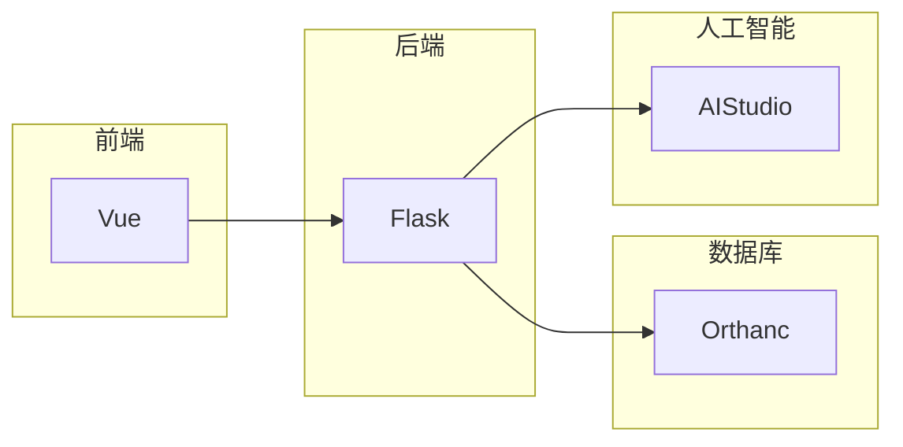
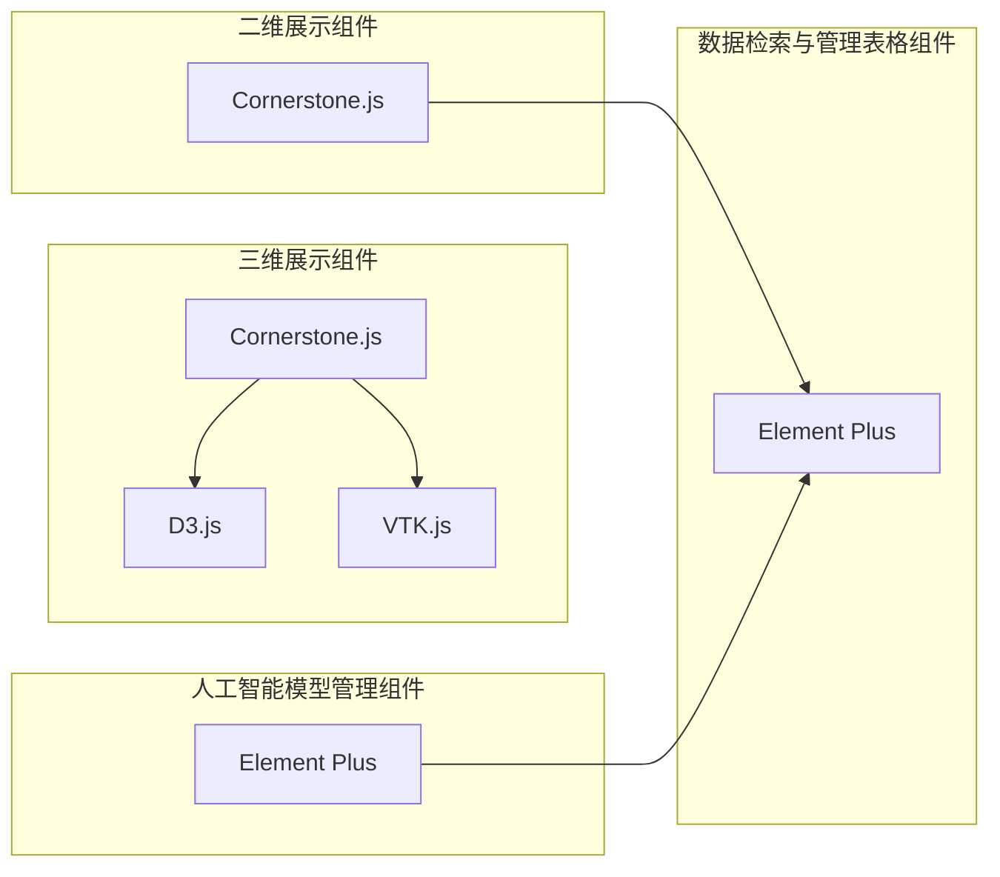
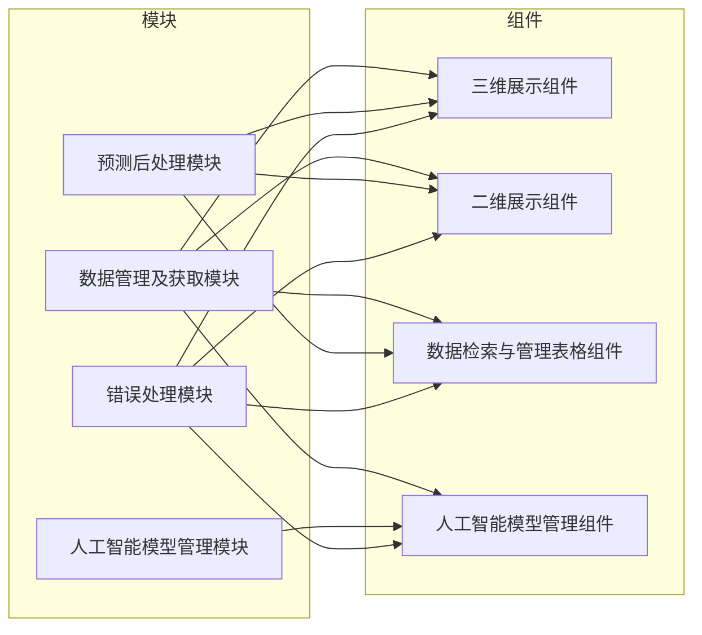

# 立项报告
> 基于人工智能的3D 医疗 Web 平台
> - 5.26 10:21
本项目是 `软件杯 医疗影像` 赛道的参赛项目。该比赛需要我们利用人工智能、大数据及 `Web3.0` 等先进技术为传统医疗影像行业赋能，促进医疗行业的信息化、智能化发展。
## 可行性分析
### 政策 （于）
### 经济 （韦）
### 技术上进行分析 （潘）
#### 技术概述
本项目前后端分离，前端采用 `JavaScript` 语言的 `Vue` 框架搭建，后端使用 `Python` 语言的 `Flask` 框架实现一套 `RESTful` 接口以支持业务。其中人工智能部分的特色功能通过调用部署在百度 `AIStusio` 上的模型接口来实现。为了经一步加强项目的健壮性，减少不必要的耦合，我们专门使用 `Orthanc` 软件来管理医疗影像数据。以下是架构略图

> 项目托管在 `GitHub` 平台上，由于参加比赛的缘故，尚未开源。比赛结束后，我们会整理好项目，并开放源码。
#### 前端项目技术分析

前端项目使用 `Vue` 框架搭建，使用 `Element Plus` 作为组件库，使用 `axios` 作为网络请求库，使用 `vue-router` 作为路由管理器。同时，为了满足医疗影像行业的一般需求，我们使用 `cornerstone.js` ， `D3.js` 及 `VTK.js` 等前端包来支撑医疗影像数据的展示、标注、管理及三维分析。为了贴合业界生产实际，我们采用 `Vite` 作为打包工具，实现自动化构建。

为了便于项目管理、构建及代码复用，我们采用 模块化、组件化 的方式构建前端项目。

我们充分利用 `Vue 组合式 api` 的特点，将不同那些重复的、易于复用的业务逻辑封装为模块（没有视图的组件）。这些模块主要包括：数据管理及获取模块、人工智能模型管理模块、预测后处理模块、错误处理模块等。由于医疗影像数据众多，结构复杂，管理困难，我们封装 `dcmjs` 及 `dicomweb-client.js`用以快速加载和检索医疗影像数据。为了便于使用百度提供的模型接口，我们将该接口封装为单独模块，并于模型管理视图配合实现拖拽式部署数据流的特色功能。人工智能模型预测结构难免有误差，所以需要人工修正。这一块需要综合数据获取、数据修改、数据检索等常规功能，所以可以将其封装为单独的模块。这些模块将必要的功能接口以命令及函数的形式暴露出来，最大限度方便视图组件的调用。

为了适应医疗影像行业的需求，我们搭建了不同的组件包括：三维展示组件、二维展示组件、数据检索与管理表格组件、人工智能模型管理组件等。通过灵活地组合与复用这些组件，我们可以快速构建适用于不同医疗影像工作流的应用页面。

以下是设计示意图：

以下是模块及组件的关系图：

## 需求分析 
### 项目的定义 （于）
### 功能性与非功能性需求 （韦）
### 需要的数据 （潘）
#### 医疗影像数据
医学影像是指为了医疗或医学研究，对人体或人体某部份，以非侵入方式取得内部组织影像的技术与处理过程。目前的主要处理方式有：X光成像（X-ray），电脑断层扫描（CT），核磁共振成像（MRI）， 超声成像（ultrasound），正子扫描（PET），脑电图（EEG），脑磁图（MEG），眼球追踪（eye-tracking），穿颅磁波刺激（TMS）等现代成像技术，用来检查人体无法用非手术手段检查的部位的过程。

一些常用的医疗影像数据格式：
- `NIfTI` nii(nii.gz) 
  - 定义：NIfTI格式是神经图像信息技术倡议（Neuroimaging Informatics Technology Initiative）的缩写，是一种自由文件格式，用于储存磁共振成像获取的大脑成像数据。
- `mhd(raw)`
    - mhd + raw 格式是常见的一种医学图像格式，每一个病人的数据包含一个mhd文件和一个同名的raw文件，使用Python的SimpleITK库即可读取。其中：
      1. mhd（数据头部信息）：存放数据的非图像信息，如图像大小、切片大小、像素大小等。
      2. raw（未加工的数据）：存储病人的图像信息，往往是三维体数据。（可以理解为将该病人不同的dicom切片图像都叠到一起，形成了一个三维图像，也就是我们通常处理的数据）。
- `dcm`
  - dcm 是 DICOM 这种医学影像文件的格式。
  - DICOM(DigitalImaging andCommunications inMedicine)是指医疗数字影像传输协定，是用于医学影像处理、储存、打印、传输的一组通用的标准协定。
    - 它包含了文件格式的定义以及网络通信协议。DICOM是以TCP/IP为基础的应用协定，并以TCP/IP联系各个系统。
    - 两个能接受DICOM格式的医疗仪器间，可通过DICOM格式的文件，来接收与交换影像及病人资料。
    - 目前，DICOM被广泛应用于放射医疗，心血管成像以及放射诊疗诊断设备（X射线，CT，核磁共振，超声等），并且在眼科和牙科等其它医学领域得到越来越深入广泛的应用。
支持模型的介绍、选择与加载
### 业务流程等 （覃）