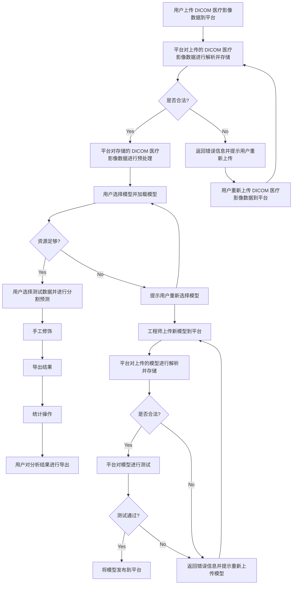
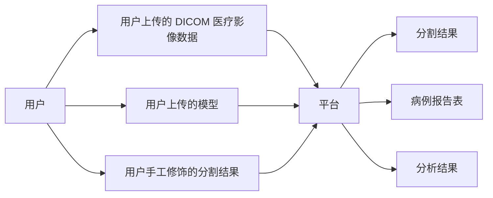
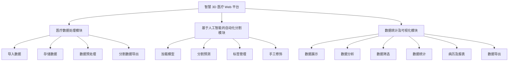
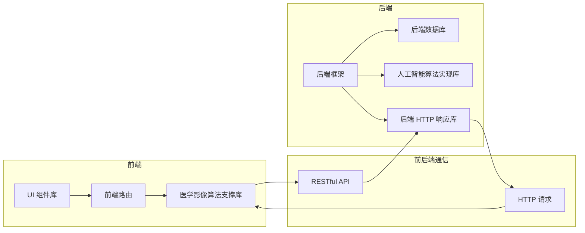

# 实验二：利用Visio工具进行面向过程的分析与设计（2学时）

## 一、	实验目的
    1、	掌握VISIO工具软件的功能特色、安装、工作环境和基本操作等各方面的基本知识
    2、	掌握应用Visio工具绘制软件开发图形的基本操作
    3、	对GIS小工程进行面向过程的分析与设计
## 二、实验内容
    1、	了解Visio的工作环境
    2、	了解菜单项
    3、	了解定位工具
    4、	了解工具栏
    5、	了解文件操作
    6、	了解绘图页面操作
## 三、实验方法和步骤
### 业务流程图
- 以一份 DICOM 医疗影像数据为例的业务流程：
  - 用户上传 DICOM 医疗影像数据到平台
  - 平台对上传的 DICOM 医疗影像数据进行解析并存储
  - 检查是否为合法的 DICOM 医疗影像数据，若不合法则返回错误信息并提示用户重新上传
  - 平台对存储的 DICOM 医疗影像数据进行预处理
  - 用户选择模型并加载模型
  - 检查系统资源是否足够，若不足则提示用户重新选择模型
  - 用户选择测试数据并进行分割预测
  - 用户对分割结果进行手工修饰
  - 用户对分割结果进行导出
  - 用户对数据进行展示、分析、筛选、统计、病历及报表生成等操作
  - 用户对分析结果进行导出
- 模型发布流程：
  - 相关算法工程师将训练好、封装好的模型上传到平台
  - 平台对上传的模型进行解析并存储
  - 平台对模型进行测试，测试通过后将模型发布到平台
  - 若模型测试不通过，则返回错误信息并提示重新上传模型
  - 用户选择模型并加载模型并进行分割预测
- 数据检索流程：
  - 用户对数据进行检索
  - 平台对用户的检索请求进行解析并返回检索结果
  - 用户对检索结果进行展示、分析、筛选、统计、病历及报表生成等操作

以下是业务流程图：

### 数据流图
> - 确定系统的输入输出
> - 由外向里画系统的顶层数据流图
> - 自顶向下逐层分解，绘出分层数据流图
- 系统输入：
  - 用户上传的 DICOM 医疗影像数据
  - 用户上传的模型
  - 用户手工修饰的分割结果
- 系统输出：
  - 分割结果
  - 病例报告表
  - 分析结果

以下是数据流图：

### 功能模块图

> - 软件名称：智慧 3D 医疗 Web 平台

1. 医疗数据处理模块
- `导入数据` : 图像支持格式包含 `nii,nii.gz,mhd,raw,dcm` 等常见格式
- `存储数据` : 支持数据的存储，支持数据的增删改查
- `数据预处理` : 支持数据的预处理，例如数据的归一化、数据的重采样、数据的裁剪等
- `分割数据导出` : 支持分割数据（算法自动预测及手工修饰后的分割数据）的导出，例如数据的导出为 `nii,nii.gz,mhd,raw,dcm` 等常见格式

2. 基于人工智能的自动化分割模块
- `加载模型` : 支持模型的介绍、选择与加载
- `分割预测` : 基于导入模型，对任一测试数据进行推理分割并将分割后的结果保存为标签
- `标签管理` : 支持标签的增删、修改和颜色的切换；支持标签的导出保存，导出的标签格式和输入图像格式一致
- `手工修饰` : 支持对模型推理分割结果进行优化，例如使用`笔刷`、`橡皮擦`、`提取最大连通域`等方式对模型推理分割结果进行优化，并将结果在三视图和 `3D 渲染效果`中展示

3. 数据统计及可视化模块
- `数据展示` : 支持数据的三视图展示，支持鼠标拖动进行切片切换、鼠标拖动带动3D原点的变化，视图支持缩放和窗宽窗位调整
- `数据分析` : 支持数据的测量、计数、自定义数据分析等功能
- `数据筛选` : 支持根据数据的属性进行筛选，例如数据的年龄、性别、病灶类型等
- `数据统计` : 支持对数据的统计分析，例如数据的年龄分布、性别分布、病灶类型分布等
- `病历及报表` : 支持对数据的病历及报表的生成，例如数据的病历、病灶分布报表等
- `数据导出` : 支持平台分析结果导出，也可以与院方系统对接，将分析结果导出到院方系统中

功能模块图如下所示：

### 软件结构图

本项目采用前后端分离的架构，前端使用 `Vue` 框架，后端使用 `Flask` 框架，前后端通过 `RESTful API` 进行通信，前端通过 `axios` 进行 `HTTP` 请求，后端通过 `Flask-RESTful` 进行 `HTTP` 响应。

- 前端架构
  - UI 组件库：`Element plus`
  - 前端路由：`Vue Router`
  - 医学影像算法支撑库：`itk.js`、`vtk.js`、`dicomParser.js`、`nifti-reader-js`、`pako`、`jszip`
- 后端架构
  - 后端框架：`Flask`
  - 后端数据库：`MySQL`
  - 人工智能算法实现库：`PaddlePaddle`
  - 后端 HTTP 响应库：`Flask-RESTful`

软件结构图如下所示：

### 甘特图
## 四、问题
    解决办法
## 五、思考题
1、	使用Visio还可以完成软件分析、设计过程中哪些类型模型的绘制？

## 六、实验总结
