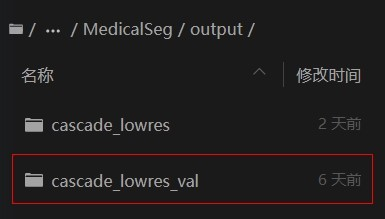

# 训练策略
> pan 4.22 13:12

研究了一下教程。发现，Baseline中给出的训练策略对应于 nnUnet 教程中的 Cascade Unet，并且 fold2 折一折在数据预处理时就已经处理好了。这样我们就只需要分别训练 f0 f1 f3 f4 这四个模型即可。我正在训练 f0 ，一个模型要进行 30000 iters 大概是 12 小时。

## 任务分配
- 潘志清 f0  
- 于嘉烨 f1
- 韦立楠 f3
- 覃仕锋 f4

## 具体操作步骤 ----- 训练 f0 为例

### 配置文件修改
找到这个文件夹


- 我的已经修改好了，你们只需要根据自己的任务修改配置文件即可。
```yml
data_root: data/

batch_size: 1
iters: 30000

model:
  type: NNUNet
  plan_path: data/preprocessed/nnUNetPlansv2.1_plans_3D.pkl
  stage: 0
  cascade: True

train_dataset:
  type: MSDDataset
  plans_name: nnUNetPlansv2.1_plans_3D.pkl
  dataset_root: /
  result_dir: /
  raw_data_dir: data/raw_data
  decathlon_dir: data/decathlon
  cropped_data_dir: data/cropped
  preprocessed_dir: data/preprocessed
  plan2d: False
  plan3d: True
  num_batches_per_epoch: 250
  fold: 0 # 修改此处 0 1 3 4
  stage: 0
  unpack_data: True
  cascade: True
  mode: train

val_dataset:
  type: MSDDataset
  plans_name: nnUNetPlansv2.1_plans_3D.pkl
  dataset_root: /
  result_dir: /
  raw_data_dir: data/raw_data
  decathlon_dir: data/decathlon
  cropped_data_dir: data/cropped
  preprocessed_dir: data/preprocessed
  num_batches_per_epoch: 50
  fold: 0 # 修改此处 0 1
  stage: 0
  plan2d: False
  plan3d: True
  unpack_data: True
  cascade: True
  mode: val


optimizer:
  type: sgd
  momentum: 0.99
  weight_decay: 0.00003
  use_nesterov: True


lr_scheduler:
  type: PolynomialDecay
  learning_rate: 0.01
  end_lr: 0
  power: 0.9

loss:
  types:
    - type: MultipleLoss
      plan_path: data/preprocessed/nnUNetPlansv2.1_plans_3D.pkl
      stage: 0
      losses:
        - type: DC_and_CE_loss
          do_bg: False
          batch_dice: False
      coef: [1.0]
  coef: [1]
```
将上述代码根据自己的编号修改好然后粘贴进去覆盖掉原来的。注意，配置文件名也要改！ 例如 f0 的配置文件名为 `nnunet_fold0.yml` ，f1 的配置文件名为 `nnunet_fold1.yml` ，以此类推。
### 运行命令调整
``` bash
    # 五折训练脚本
    %cd ~/PaddleSeg/contrib/MedicalSeg/ 
    !python train.py --config ~/configs/nnunet_fold0.yml \
            --log_iters 20 --precision fp16 --nnunet --save_dir output/cascade_lowres/fold0 --save_interval 2000 --use_vdl
    # !python train.py --config ~/configs/nnunet_fold1.yml \
    #         --log_iters 20 --precision fp16 --nnunet --save_dir output/cascade_lowres/fold1 --save_interval 2000 --use_vdl
    # !python train.py --config ~/configs/nnunet_fold3.yml \
    #         --log_iters 20 --precision fp16 --nnunet --save_dir output/cascade_lowres/fold3 --save_interval 2000 --use_vdl
    # !python train.py --config ~/configs/nnunet_fold4.yml \
    #         --log_iters 20 --precision fp16 --nnunet --save_dir output/cascade_lowres/fold4 --save_interval 2000 --use_vdl
```
将上述代码复制并覆盖掉原来的 step5 （第一部分训练 不是第二部分推理）

> 然后根据自己分配到的任务，注释掉其他的代码，只运行自己的代码。我是 f0 ，所以只运行第一行代码。以此类推。

### 运行
点击第五步修改后的运行按钮就开始训练了。训练过程中可以在 output/cascade_lowres/fold0/ 文件夹下看到训练日志和模型文件。每20000步保存一次模型参数。大概要等 12 小时左右。建议是第一天先启动一下环境拿 8 点，然后第二天就可以有 16 点了一次性训练好了。

> 后面怎么弄我再看。先这样训练起来。训练好了环境不要销毁，我可能需要把模型联合起来再训练第二阶段。
> 算力不够可以互相点连接刷算力。


## 训练结果评测 ----- f0 为例
> - 这里介绍 3000 iters 训练完成后需要做的事
> - 注意：在执行一下步骤之前，请确保有 3000 iters 的模型参数文件。如果没有，请先训练 3000 iters。

> 30000 iters 模型建议先打包压缩放在本地，以防丢失。

### 删除数据以腾出空间
1. 首先查看 `PaddleSeg/contrib/MedicalSeg/output` 文件夹，看看是否有 `cascade_lowres_val` 文件夹。若有，说明你之前已经运行过验证步骤，可能验证的是 Baseline 模型，在这个文件夹里会存放预测数据还有原比赛数据，数据量比较大，所以需要删除。见下图：

> 注意：
> - 删除本文件夹后，后续步骤仍会生成新的 `cascade_lowres_val` 文件夹，那个才是真正的验证结果，不必删除。
1. 然后查看 `PaddleSeg/contrib/MedicalSeg/output/cascade_lowres` 文件夹下的内容。找到你所训练的fold，例如我是 f0 ，所以找到 `fold0` 文件夹，然后打开该文件夹。见下图：
   
  > 仅保留最大的（30000），其余删除即可。

### 验证你所训练的模型
首先看官方给的脚本:

- 上图中的两步就是验证模型所需的命令。请参考我改写的命令，修改自己的。
- 第一步命令不用动，只需要修改第二步命令即可。

  ``` bash
  # 为了防止内存溢出，请替换cascade预测下一阶段的部分代码
  !mv ~/PaddleSeg/contrib/MedicalSeg/nnunet/utils/cascade_utils.py ~/PaddleSeg/contrib/MedicalSeg/nnunet/utils/cascade_utils_backup.py 
  !cp ~/cascade_utils.py ~/PaddleSeg/contrib/MedicalSeg/nnunet/utils/
  ```
- 第二步命令修改如下： 只是将 `fold0` 改成自己的编号即可。
  ``` bash
  # 验证模型
  %cd ~/PaddleSeg/contrib/MedicalSeg/
  !python nnunet/single_fold_eval.py --config ~/configs/nnunet_fold0.yml \ # 这里改成自己的编号
          --model_path output/cascade_lowres/fold0/iter_30000/model.pdparams --val_save_folder output/cascade_lowres_val \ # 这里改成自己的编号
          --precision fp16 --predict_next_stage
  ```
- 然后运行第二步命令即可。运行完后会在 `PaddleSeg/contrib/MedicalSeg/output/cascade_lowres_val` 文件夹下生成验证结果。

### 模型推理并提交
直接看 step7 的代码，修改自己的编号即可。也是只需要修改文件夹名称。
``` bash
%cd ~/PaddleSeg/contrib/MedicalSeg/
!python nnunet/predict.py --image_folder data/decathlon/imagesTs \
    --output_folder ~/submit \
    --plan_path data/preprocessed/nnUNetPlansv2.1_plans_3D.pkl \
    --model_paths output/cascade_lowres/fold0/iter_30000/model.pdparams \   # 修改这里 fold0 为自己的编号
    --postprocessing_json_path output/cascade_lowres_val/postprocessing.json --model_type cascade_lowres \
    --num_threads_preprocessing 1 --num_threads_nifti_save 1
```
- 最后运行一下打包命令就可以提交打分了。

> 这一步有可能会爆显存，按照官方提示，可以运行上一步的命令。

### 我需要的文件
每一折训练完后，需要再联合起来推理。所以需要保存每一折的模型参数文件，以及验证结果。
- 模型参数文件：`PaddleSeg/contrib/MedicalSeg/output/cascade_lowres/fold0/iter_30000/`
- 验证结果：`PaddleSeg/contrib/MedicalSeg/output/cascade_lowres_val/fold_2/postprocessing.json`
将 `iter_30000` 文件夹和 `postprocessing.json` 文件复制到本地，压缩好发到群里。例如我是 f0 ，所以压缩文件名为 `f0.zip` 。文件夹结构:

``` bash
f0.zip
├── iter_30000
│   ├── model.pdiparams
│   └── model.pdopt
└── postprocessing.json
```