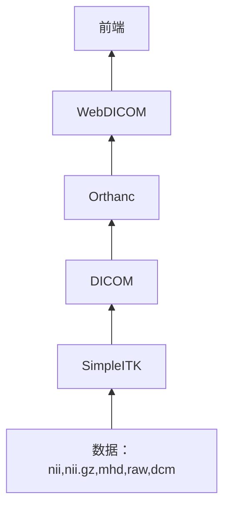
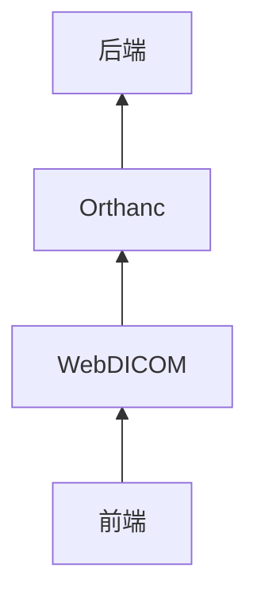
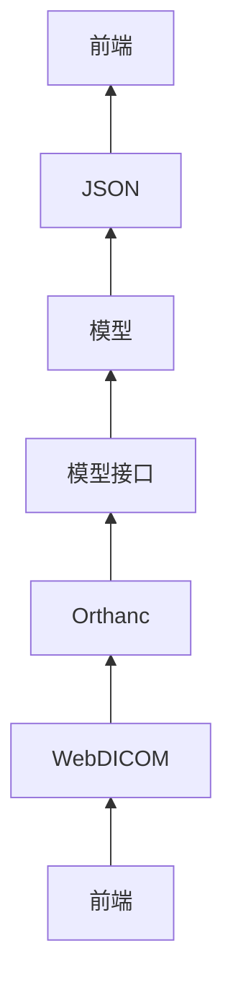

# 项目说明文档
> 这是需要提交系统的项目说明文档。

## 文件管理
比赛方要求我们设计的系统支持 `nii,nii.gz,mhd,raw,dcm` 等常见格式。

### 数据上传系统
由于我们采用 Orthanc 管理数据，所以我们在后台将所有传入的数据先转换为 DICOM 数据，然后存入 Orthanc 最后在前端使用标准的WebDICOM 协议（WADO接口）访问这些数据。

### 数据下载管理
我们在系统中使用了 Orthanc 作为数据管理系统，Orthanc 是一个开源的医疗影像管理系统，它提供了一个 RESTful API，可以通过 HTTP 协议访问，这样我们就可以通过 HTTP 协议访问 Orthanc 中的数据，而不需要直接访问数据库。如果有特殊需求，用户也可以选择将 Orthanc 中的数据发送到后端进行处理。

## 模型接口
使用 Falsk 封装官方的 Baseline 推理模型，提供 RESTful API 接口，方便前端调用。数据处理好了后会首先转换为 DICOM 格式的数据存入 Orthanc 然后系统返回一个 DICOM 的 ID，前端可以通过这个 ID 访问到这个数据，然后将这个 ID 传入模型接口，模型接口会返回一个 JSON 格式的数据，前端可以通过这个数据进行可视化。

## 三维数据展示
这次的医疗影像数据与体素模型有一些相似，单纯将分割结果提取为空心模型难以准确展示分割结果。我们采用 VTK 库，使用类似于体素绘制的方式，将医疗影像序列的每一个断面按照一定透明度绘制出来以实现三维展示效果。