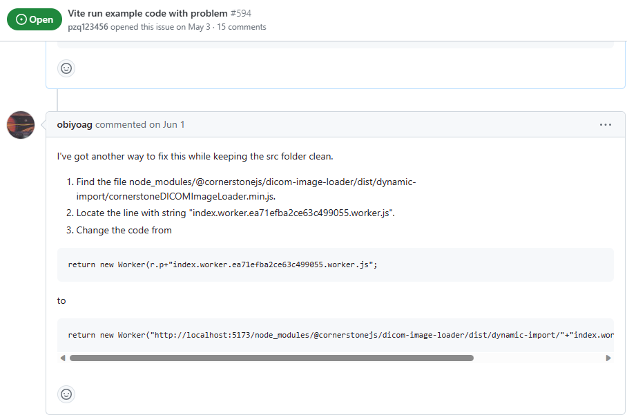

# 项目说明文档
> 基于人工智能的3D 医疗 Web 平台
本项目是 `软件杯 医疗影像` 赛道的参赛项目。该比赛需要我们利用人工智能、大数据及 `Web3.0` 等先进技术为传统医疗影像行业赋能，促进医疗行业的信息化、智能化发展。
## 项目功能介绍

### 分割及分割工具介绍
#### 思路
分割功能支持三视图同步渲染，也就是说，用户在一个视图中的分割操作会同步到其他两个方向的视图中。本项目所有的数据渲染均在 WebGL 上下文中同步渲染，正因为此，我们才可以做到同步渲染分割结果。以下是具体分割效果：
1. 一般画刷：可以设置画刷的半径。
   
2. 圆球画刷：在三维空间中绘制一个圆球，可以设置圆球的半径。
    
3. 矩形画刷：在当前平面上绘制一个矩形，可以设置矩形的长宽。
    
4. 阈值画刷：在当前平面上绘制一个矩形，可以设置矩形的长宽，然后设置阈值，当像素值大于阈值时，将像素标记为前景，否则标记为背景。（例如，可以设置脂肪、骨骼等阈值）
    


## 项目实现要点
### 文件管理
比赛方要求我们设计的系统支持 `nii,nii.gz,mhd,raw,dcm` 等常见格式。

- 数据上传系统
    由于我们采用 Orthanc 管理数据，所以我们在后台将所有传入的数据先转换为 DICOM 数据，然后存入 Orthanc 最后在前端使用标准的WebDICOM 协议（WADO接口）访问这些数据。
    ```mermaid
    graph BT
        A["数据：nii,nii.gz,mhd,raw,dcm"] --> B["SimpleITK"]
        B --> C["DICOM"]
        C --> D["Orthanc"]
        D --> E["WebDICOM"]
        E --> F["前端"]
    ```

- 数据下载管理
    我们在系统中使用了 Orthanc 作为数据管理系统，Orthanc 是一个开源的医疗影像管理系统，它提供了一个 RESTful API，可以通过 HTTP 协议访问，这样我们就可以通过 HTTP 协议访问 Orthanc 中的数据，而不需要直接访问数据库。如果有特殊需求，用户也可以选择将 Orthanc 中的数据发送到后端进行处理。
    ```mermaid
    graph BT
        A["前端"] --> B["WebDICOM"]
        B --> C["Orthanc"]
        C --> D["后端"]
    ```

### 模型接口
使用 Falsk 封装官方的 Baseline 推理模型，提供 RESTful API 接口，方便前端调用。数据处理好了后会首先转换为 DICOM 格式的数据存入 Orthanc 然后系统返回一个 DICOM 的 ID，前端可以通过这个 ID 访问到这个数据，然后将这个 ID 传入模型接口，模型接口会返回一个 JSON 格式的数据，前端可以通过这个数据进行可视化。


### 三维数据展示
这次的医疗影像数据与体素模型有一些相似，单纯将分割结果提取为空心模型难以准确展示分割结果。我们采用 VTK 库，使用类似于体素绘制的方式，将医疗影像序列的每一个断面按照一定透明度绘制出来以实现三维展示效果。


## 项目设计文件
### 项目进度安排
- 本项目的参与人员: 潘志清、于嘉烨、韦立楠、覃仕锋。
- 项目起止日期: 2023.5.20 - 2023.7.20
- 项目的主要任务: 
  - 前端
    - 页面整体设计
    - 组件编写与测试
      - 用户交互组件设计与实现
      - 业务逻辑组件设计与实现
    - 页面整合与测试
      - 组件挂载
      - 页面整合
      - 页面测试
    - 与后端接口整合
    - 前端生产打包、部署
  - 后端
    - 模型设计
    - 模型训练
    - 模型部署级封装
    - 数据库设计
    - 数据库接口设计与测试
    - 数据库部署
  - 文档
    - 项目开发文档编写
    - 软件用户说明书编写
    - **甘特图**
    ```mermaid
    gantt
    title 项目进度安排
    dateFormat  YYYY-MM-DD
    section 前端
    页面整体设计: 2023-05-20, 2023-05-25
    组件编写与测试: 2023-05-25, 2023-06-05
    页面整合与测试: 2023-06-05, 2023-06-10
    与后端接口整合: 2023-06-10, 2023-06-15
    前端生产打包、部署: 2023-06-15, 2023-06-20
    section 后端
    模型设计: 2023-05-20, 2023-05-25
    模型训练: 2023-05-25, 2023-06-05
    模型部署级封装: 2023-06-05, 2023-06-10
    数据库设计: 2023-06-10, 2023-06-15
    数据库接口设计与测试: 2023-06-15, 2023-06-20
    数据库部署: 2023-06-20, 2023-06-25
    section 文档
    项目开发文档编写: 2023-05-20, 2023-06-10
    软件用户说明书编写: 2023-06-10, 2023-06-20
    ```

## 可行性分析
### 技术上进行分析
#### 技术概述
本项目前后端分离，前端采用 `JavaScript` 语言的 `Vue` 框架搭建，后端使用 `Python` 语言的 `Flask` 框架实现一套 `RESTful` 接口以支持业务。其中人工智能部分的特色功能通过调用部署在百度 `AIStudio` 上的模型接口来实现。为了经一步加强项目的健壮性，减少不必要的耦合，我们专门使用 `Orthanc` 软件来管理医疗影像数据。以下是架构略图

> 项目托管在 `GitHub` 平台上，由于参加比赛的缘故，尚未开源。比赛结束后，我们会整理好项目，并开放源码。
#### 前端项目技术分析

前端项目使用 `Vue` 框架搭建，使用 `Element Plus` 作为组件库，使用 `axios` 作为网络请求库，使用 `vue-router` 作为路由管理器。同时，为了满足医疗影像行业的一般需求，我们使用 `cornerstone.js` ， `D3.js` 及 `VTK.js` 等前端包来支撑医疗影像数据的展示、标注、管理及三维分析。为了贴合业界生产实际，我们采用 `Vite` 作为打包工具，实现自动化构建。

为了便于项目管理、构建及代码复用，我们采用 模块化、组件化 的方式构建前端项目。

我们充分利用 `Vue 组合式 api` 的特点，将那些重复的、易于复用的业务逻辑封装为模块（没有视图的组件）。这些模块主要包括：数据管理及获取模块、人工智能模型管理模块、预测后处理模块、错误处理模块等。由于医疗影像数据众多，结构复杂，管理困难，我们封装 `dcmjs` 及 `dicomweb-client.js`用以快速加载和检索医疗影像数据。为了便于使用百度提供的模型接口，我们将该接口封装为单独模块，并与模型管理视图配合实现拖拽式部署数据流的特色功能。人工智能模型预测结果难免有误差，所以需要人工修正。这一块需要综合数据获取、数据修改、数据检索等常规功能，所以可以将其封装为单独的模块。这些模块将必要的功能接口以命令及函数的形式暴露出来，最大限度方便视图组件的调用。

为了适应医疗影像行业的需求，我们搭建了不同的组件包括：三维展示组件、二维展示组件、数据检索与管理表格组件、人工智能模型管理组件等。通过灵活地组合与复用这些组件，我们可以快速构建适用于不同医疗影像工作流的应用页面。

以下是设计示意图：

以下是模块及组件的关系图：

## 需求调研
- 随着人工智能技术的不断发展，应用于医疗领域的机会和潜力日益增加。基于人工智能的3D医疗Web平台是一种结合了人工智能、虚拟现实和Web技术的创新解决方案，旨在提供更精准、高效、可视化的医疗服务和教育体验。
- 需求调研目的：通过需求调研，我们旨在了解用户对基于人工智能的3D医疗Web平台的期望和需求，为平台的开发和设计提供指导和参考。
- 调研方法：通过在线问卷和面对面访谈的方式进行需求调研，共收集到来自医生、医学教育从业者和患者等各个群体的意见和建议。
- 调研结果：
（1）功能需求：
医疗影像处理和分析：利用人工智能算法处理医疗影像数据，自动识别病变和异常情况，并提供精确的分析报告。
虚拟手术模拟：提供真实的3D虚拟手术环境，帮助医生进行手术前的规划和模拟。
医学教育和培训：提供医学生和医生的在线教育课程、实时交流平台以及虚拟实验室等功能。
患者服务与管理：提供患者预约、健康档案管理、医疗咨询等服务，方便患者与医生之间的沟通和协作。
（2）用户界面需求：
直观易用：简洁明了的界面设计，操作便捷，符合用户习惯。
可视化展示：在3D空间中展示医疗影像数据和手术模拟过程，使用户能够直观地理解和分析。
多终端兼容：支持在各种终端设备上使用，如电脑、平板和手机等。
（3）数据安全需求：数据加密和隐私保护：对于患者和医疗机构的敏感数据进行加密存储和传输，并采取严格的权限管理措施。
系统稳定可靠：保证平台运行的稳定性和可靠性，避免数据丢失和系统崩溃等不良情况。
基于人工智能的3D医疗Web平台的需求调研结果表明，用户对于精准的医疗影像处理、手术模拟、医学教育和患者服务等功能有较高的期待。用户界面的直观易用性和数据安全的保护也是用户关注的重点。在设计和开发平台时，需要充分考虑用户需求，并结合最新的人工智能技术和Web技术进行创新，以提供更优质的医疗服务和用户体验。

## 分析
### 项目的定义
- 我们致力于构建一个基于Web的人工智能3D诊疗平台，用户可以输入或者浏览检索数据库中的医学影像，利用我们提供的人工智能算法完成对医学影像的2D和3D模型构建，同时可以利用我们提供的工具完成对医学影像的测量、标注和统计数据的浏览，并且能利用我们提供的人工智能分析算法完成对潜在病灶的预测，实现辅助诊断的功能。

### 功能性与非功能性需求
1. 功能性需求
3D数据读取与推理(包括导入数据、加载模型和分割预测)
导入数据:图像支持格式包含nii,nii.gz,mhd,raw,dcm等常见格式
- 加载模型:支持模型的介绍、选择与加载
分割预测:基于导入模型，对任一测试数据进行推理分割并将分割后的结果保存为标签
- 标签管理:支持标签的增删、修改和颜色的切换；支持标签的导出保存，导出的标签格式和输入图像格式一致；（通常来说，图像分割的输入是一张图像，输出也是一张图像，每个像素点都对应一个标签。）
- 预测展示：
原图和标签支持3D可视化三视图展示原图和标签显示，每个视图支持鼠标拖动进行切片切换、鼠标拖动带动3D原点的变化，视图支持缩放和窗宽窗位调整支持使用笔刷、橡皮擦、提取最大连通域等方式对模型推理分割结果进行优化，并将结果在三视图和3D渲染效果中展示。
数据分析
（1）测量:基于spacing等参数，获取测量分割目标在x,y,z切面上的直径、面积和目标体积等结果。
（2）计数:基于现有分割结果，统计不同类别数据的个数，例如某类病灶的计数
- 自定义数据分析:基于用户上传的后处理脚本返回结果进行合理的展示和分析（可以规定后处理的返回内容和方式）。
- 统计结果展示:针对用户上传的所有医疗数据进行上述分析，并对分析结果进行图标展示.并支持显示所有符合筛选要求的数据索引
其他附加功能
根据各类分割及分析结果，自动生成高质量病例报告。
筛选:支持根据数据的属性进行筛选，例如数据的年龄、性别、病灶类型等。
2. 非功能性需求
（1）安全需求：系统必须具备安全性和隐私性保护机制，确保医学数据及时、准确、安全的传输和存储。
（2）可靠性需求：对输入的数据有提示，有检查，防止数据异常。并且系统健壮性强，应该能处理系统运行过程中出现的各种异常情况，如：人为操作错误、输入非法数据、硬件设备失败等，系统应该能正确的处理，恰当的回避。
（3）兼容性需求：系统应支持IOS，Android,Windows操作系统。
易用性需求：在网站主界面应简洁地表现大部分常用功能，使用户在一定时间内便可找到所需的功能。
（4）可维护性需求：90%的BUG修改时间不超过1个工作日，其他不超过2个工作日。产品必须提供可跟踪任何数据库字段的工具。
性能需求：业务量方面，最大操作并发数为50，系统可以同时满足100个用户请求，并为200个并发用户提供浏览功能。系统容量应足够大，以存放相应的数据
①需要的数据
医学影像是指为了医疗或医学研究，对人体或人体某部份，以非侵入方式取得内部组织影像的技术与处理过程。目前的主要处理方式有：X光成像（X-ray），电脑断层扫描（CT），核磁共振成像（MRI），超声成像（ultrasound），正子扫描（PET），脑电图（EEG），脑磁图（MEG），眼球追踪（eye-tracking），穿颅磁波刺激（TMS）等现代成像技术，用来检查人体无法用非手术手段检查的部位的过程。
②	业务流程
（a）定义业务需求
医学影像是临床疾病诊断的重要方式，高效精准的从影像中识别出器官结构或病变，是医学影像学中重要的课题。根据成像原理，医疗影像可以粗略分为两类：
2D成像：一种是在可见光下获取的RGB彩照，如眼底彩照、皮肤彩照等；
3D成像：借助非可见光或其它物理效应，由计算机辅助成像，如CXR/DR(X-Ray)，CT，核磁共振(MRI)等。如CT与MRI数据是多个2D切片沿第三个空间维度堆叠而成的；其中，3D影像能够更直观辅助医生提升诊断效率。然而，医疗影像的读片工作对专业知识要求高，这样繁重且重复性较高的阅片工作，仅能由专业的影像科医生完成。另一方面，医疗影像在医学检查中愈发常见，对阅片专家的需求也在增加。随着深度学习技术的发展，我们看到了使用AI技术辅助医生快速分析阅片、减轻阅片工作负担的可能性。
（b）项目框架


## 概要设计
### 1. 系统总体架构
- 医学影像是临床疾病诊断的重要方式，高效精准的从影像中识别出器官结构或病变，是医学影像学中重要的课题，其中，3D影像能够更直观地辅助医生提升诊断效率。然而，医疗影像的读片工作对专业知识要求高，工作繁重且重复性较高，常常仅能由专业的影像科医生完成。随着深度学习技术的发展，我们看到了使用AI技术辅助医生快速分析阅片、减轻阅片工作负担的可能性。
- 目前医学上应用最广泛的是DICOM影像，但其不会直接包含深度信息，而是通过图像序列的堆叠或切片信息来表示三维空间中的深度信息。每个切片包含二维图像数据，并通过堆叠或排序这些切片，可以还原出三维体积数据，从而得到深度信息。
- 此外，有些DICOM影像可以包含其他与深度相关的元数据，例如切片厚度（SliceThickness）和间隔（SliceSpacing）。这些元数据提供了关于DICOM影像中切片的物理厚度和间隔的信息，可以用于计算图像中结构或病灶的深度。
- 对于医学图像中的深度信息，常常需要进行后续的图像处理和分析，如体素重建、体积测量、三维重建等。我们的项目就是想要实现三维模型的构建，并且对病灶完成分析和计算。
- 本项目中的算法由百度飞桨提供，只需要通过调整参数完成模型的训练，需完成软件部分的开发工作。包含医疗数据的导入、分割、可视化和数据分析功能四大基础功能，且飞桨模型可在本地或云端部署进行推理。前端部分主要采用Vue3.0的框架，结合Cornerstone.js和VTK.js两个主要的前端js库，和其他界面美化的前端库，完成对数据可视化部分的搭建，并实现用户的交互。
- 后端主要采用Python语言，利用Flask框架搭建后端系统，算法部分通过百度飞桨所提供的代码，通过修改参数和服务器配置完成算法部分的实现。前后端的通信通过HTTP请求利用和RESTfulAPI来实现。数据库方面，DICOM影像的存储利用了开源的Orthanc数据库，此外还构建了Radis缓存数据库用来展示加载和处理进度，sqlite关系数据库用来存储患者病例信息等基本信息。

<center>搭建的软件的整体框架图如图</center>
### 2. 各模块功能设计
- 设置数据处理、模型建立和处理和数据可视化和分析处理三个主要模块。
- （1）数据处理：包括影像数据的导入和导出、数据的预处理，包括提取DICOM头文件信息等，还有模型的上传和下载并且可以对模型进行预加载，防止用户调用时加载过慢。
- （2）模型的建立和处理：包括影像分割预测后进行模型的构建，并且构建一套评价系统对模型的精度进行评价，再添加模型的人工修饰部分，可以人为的完善一下构建出的模型。
- （3）数据可视化与分析处理：包括对构建出的模型进行二维和三维的展示，用仪表盘等样式展示影像和模型的基本信息。添加用户交互部分，包括用户对模型的测量，还有对影像和模型的标绘，并且对模型的各项参数信息进行展示，用户也可以修改部分参数对模型进行重建。此外，添加医疗辅助部分，提供病例的填写和内容展示，病灶的自动解析和病例导出等功能，辅助医生的诊断过程。

<center>功能模块架构图</center>
## 详细设计
### 数据库设计
- 在该系统中，我们围绕医疗影像序列(Series)这一实体进行建模，该实体与其他实体的关系如下：
- 医疗影像序列(Series)与医疗影像统计信息(Statistics)是一对一关系，一个医疗影像序列对应一条医疗影像统计信息。
- 我们使用数据操作实体来描述数据处理操作，数据处理操作既可以只包含简单的处理脚本也可以包含模型(Model)。在实际实现中，我们的数据流水管线是一个包含一系列数据处理操作的队列，数据流水管线(DataPipeline)与数据处理操作(DataProcessingOperation)是一对多关系，一个数据流水管线对应多个数据处理操作。
- 用户通过调用自动分割任务(AutoSegmentationTask)来使用模型(Model)对医疗影像序列(Series)进行自动分割。自动分割任务通过构造数据流水管线(DataPipeline)来实现，数据流水管线(DataPipeline)是由数据处理操作(DataProcessingOperation)构成的，数据处理操作(DataProcessingOperation)包括数据预处理与后处理，可相互叠加。一个数据流水管线对应一个自动分割任务，一个自动分割任务对应一个医疗影像序列。自动分割任务(AutoSegmentationTask)与自动分割(AutoSegmentationResult)是一对一关系，一个自动分割任务对应一个自动分割结果。自动分割的过程附带进行病理统计，因此自动分割结果(AutoSegmentationResult)与医疗影像统计信息(Statistics)是一对一关系，一个自动分割结果对应一条医疗影像统计信息。
- 用户可以调用手动修饰任务对自动分割结果(AutoSegmentationResult)进行手动修饰，一个手动修饰任务对应一个自动分割结果，一个手动修饰任务对应一个医疗影像序列。手动修饰任务(ManualModificationTask)与手动修饰结果(ManualModificationResult)是一对一关系，一个手动修饰任务对应一个手动修饰结果。手动修饰的过程附带进行病理统计，因此手动修饰结果(ManualModificationResult)与医疗影像统计信息(Statistics)是一对一关系，一个手动修饰结果对应一条医疗影像统计信息。
- 用户可以调用模型发布任务(ModelPublishTask)将模型(Model)发布到系统中，一个模型发布任务对应一个模型。一次模型发布任务执行成功后创建一个模型，一个模型实体对应一个模型发布任务。模型发布任务(ModelPublishTask)与模型(Model)是一对一关系，一个模型发布任务对应一个模型。系统可以在模型列表中显示所有已发布的模型。

<center>数据库ER图</center>


<center>部分实体代码结构</center>


<center>数据库CDM关系图</center>

### 2. 具体功能设计
- （1）系统用例设置
用户和管理员对应不同的功能模块，用户主要操作数据分析模块，能够切换不同视图，并完成测量、计数等，能够自定义数据分析。管理员主要对数据进行管理，优化数据展示，改进影响分割和模型加载算法和对应参数，并管理影像的标签，预处理DICOM影像数据。根据用户和管理员不同的职责，绘制的用例图如下图所示。

<center>系统用例图</center>

- （2）系统类设计
为方便系统功能的开发，选择面向对象的开发模式，主要构建了模型类和分析处理类。在模型类中，要对模型的ID、参数等创建对应的属性，并且设置方法来获取模型的参数和信息，设置修改方法来对模型的参数进行修改，方便优化模型。
分析处理类继承模型类，方便调用模型中的各项内容，具体如下图所示

<center>类图</center>

- （3）系统信息传递模式
为直观描述系统对象之间交互的顺序。将交互行为建模为消息传递，通过描述消息是如何在对象间发送和接收的来动态展示对象之间的交互，绘制了如下的时序图：

<center>时序图</center>

### 3. 界面设计
- 1. 导航栏：在页面的顶部或侧边可以放置一个导航栏，用于提供主要功能链接，例如首页、患者信息、医疗影像、诊断工具等。
患者信息区域：将患者的个人信息和医疗记录呈现在一个区域内，包括姓名、年龄、性别、过往病史等重要信息，方便医护人员查看和管理。
- 2. 医疗影像展示：使用Three.js等库实现一个可交互的3D场景，在其中展示医学影像数据，比如CT扫描、MRI等。用户可以旋转、缩放和浏览不同切片，以更好地了解患者的病情。
诊断工具面板：提供一系列诊断工具和算法，比如肿瘤自动分割、血管重建等。用户可以通过界面上的按钮选择和操作这些工具，以辅助诊断和治疗决策。
- 3. 数据统计和分析：显示患者的病例统计和分析结果，如病变区域大小、影像特征等，帮助医护人员更好地理解患者的病情和预测治疗效果。
- 4. 交互式操作：提供简单而直观的交互方式，如鼠标点击、滚动、拖拽等，以控制3D场景中的视角和工具操作。还可以考虑支持手势识别和虚拟现实设备，提供更加沉浸式的用户体验。
- 5. 响应式设计：确保界面在不同屏幕尺寸和设备上都能够良好展示和操作，包括桌面电脑、平板电脑和手机等。
其他辅助功能：考虑添加一些辅助功能，如搜索功能、筛选和排序功能，以便快速检索患者信息和影像数据。

<center>主界面</center>

## 编码实现	
- 首先我们确定该系统采用的技术栈及项目管理工具。

<center>上图，编码实现技术栈及管理工具</center>

- 我们使用Git及GitHub作为该项目及本团队的管理工具。采用自动化文档生成工具辅助项目文档的编写。本项目采用前后端分离的设计，其中，前端采用VUE框架，针对医疗影像数据我们引入Cornerstone.js包进行渲染、处理等操作。由于需要部署智能分割算法，后端我们采用Python语言编写，使用Flask框架包装模型为借口。下图是具体的项目结构：

<center>上图，编码实现项目结构</center>

- 我们采用组件式编程思想，首先编写基础组件然后将这些组件组合成视图，将医疗影像的处理抽象为工作流并通过不同的视图提供对不同工作流的支持。
Components：用于编写一些工具组件例如顶部导航栏、侧边工具栏、注册登录卡片、基础影像可视化组件等。
Views：用于配合不同的工作流设计不同的视图，主要包括二维数据标注视图、三维数据查看视图、病例表格视图等


<center>上图，编码实现视图库</center>


- App.vue&main.ts：前端项目入口文件，所有的组件都会依靠这两者中的逻辑进行挂在、渲染及移除。
编码实例：最简单的Cornerstone.js编码实例。
```js
<template>
<h5>2D视图开发中</h5>
<ahref="https://www.cornerstonejs.org/docs/category/getting-started">库访问连接</a>
<ahref="https://cn.vuejs.org/api/composition-api-lifecycle">Vue文档</a>
<ahref="https://juejin.cn/post/7132361845796503566">教程</a>

<divid="content"></div>
</template>

<scriptsetup>

import{RenderingEngine,Enums}from'@cornerstonejs/core';
import{
initDemo,
createImageIdsAndCacheMetaData,
ctVoiRange,
}from'./helpers'

import{
onMounted,
ref,
}from'vue';

const{ViewportType}=Enums;

onMounted(()=>{
//usingreftoget'content'element
constcontent=ref(document.getElementById('content'));
constelement=document.createElement('div');
element.id='cornerstone-element';
element.style.width='500px';
element.style.height='500px';
//andthenappendtheelementto'content'
content.value.appendChild(element);
run(element);
});

/**
*Runsthedemo
*/
asyncfunctionrun(element){
//InitCornerstoneandrelatedlibraries
awaitinitDemo();

//GetCornerstoneimageIdsandfetchmetadataintoRAM
constimageIds=awaitcreateImageIdsAndCacheMetaData({
StudyInstanceUID:
'1.3.6.1.4.1.14519.5.2.1.7009.2403.334240657131972136850343327463',
SeriesInstanceUID:
'1.3.6.1.4.1.14519.5.2.1.7009.2403.226151125820845824875394858561',
wadoRsRoot:'https://d3t6nz73ql33tx.cloudfront.net/dicomweb',
});

//Instantiatearenderingengine
constrenderingEngineId='myRenderingEngine';
constrenderingEngine=newRenderingEngine(renderingEngineId);
//Createastackviewport
constviewportId='CT_STACK';
constviewportInput={
viewportId,
type:ViewportType.STACK,
element,
defaultOptions:{
background:[0.2,0,0.2],
},
};

renderingEngine.enableElement(viewportInput);
//Getthestackviewportthatwascreated
constviewport=(
renderingEngine.getViewport(viewportId)
);
//Defineastackcontainingasingleimage
conststack=[imageIds[10]];
console.log(imageIds[10]);
//Setthestackontheviewport
awaitviewport.setStack(stack);
//SettheVOIofthestack
viewport.setProperties({voiRange:ctVoiRange});
//Rendertheimage
viewport.render();
}

</script>
<style scoped>
</style>
```
- 其中，原始官方示例存在一些配置方面的错误，我们使用GitHub平台与该项目的开发人员取得联系，协商过后终于在当前开发环境下运行成功。

<center>上图，编码实现问题协商</center>

## 前后端交互调试
导入医疗影像，点击分割功能，调用后端服务器自动分割模型。并将其分割后dicom数据格式导入后端服务器数据库。查看病例表格数据，将会调用后端病例table。如下图所示


